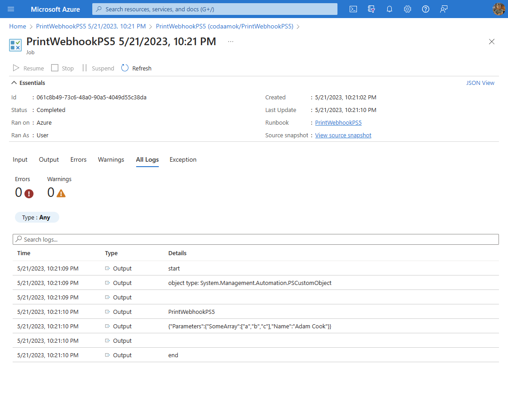

I originally wanted to use this post to show you how you can workaround the [invalid json known issue](https://learn.microsoft.com/en-us/azure/automation/automation-runbook-types?tabs=lps71%2Cpy27#limitations-and-known-issues) in Azure Automation runbooks using PowerShell 7.1 (preview). I encountered the issue around a week ago working on some automation at work.

However, it seems the issue has been resolved in PowerShell 7.2 preview! :tada: 

I deliberated whether to write this post or not, given that the issue is fixed in a newer runtime, but I'm happy with the solution and still want to share it even if just for a future reference. Perhaps you're for some reason restricted to 7.1.

# What is the invalid JSON issue?

As documented on the known issues:

> _When you start PowerShell 7 runbook using the webhook, it auto-converts the webhook input parameter to an invalid JSON._

If you invoked a PowerShell 7.1 runbook via webhook, Azure couldn't correlate deserialise the incoming JSON payload into a PowerShell object. You wouldn't see errors in your runbook logs until you tried using `ConvertFrom-Json` on the `RequestBody` property.

To show you what I mean, take the following runbook code example:

```powershell
param (
    [Parameter()]
    [object] $WebhookData
)

Write-Output 'Start'
Write-Output ('Type: {0}' -f $WebhookData.GetType())

Write-Output $WebhookData
Write-Output $WebhookData.WebhookName
Write-Output $WebhookData.RequestBody

$Obj = ConvertFrom-Json -InputObject $WebhookData.RequestBody -ErrorAction 'Stop'
Write-Output $Obj

Write-Output 'End'
```

Call the above runbook code via webhook using:

```powershell
Invoke-RestMethod -Uri $webhookurl -Method 'Post' -Body (@{ Parameters = @{ Name = "Adam Cook"; SomeArray = 'a','b','c' } } | ConvertTo-Json -Compress)
```

Checkout the log screenshots below. You'll see for the runbook named PrintWebhookPS71, the object type is `System.String` whereas for the other runtimes - 5.1 and 7.2 - Azure successfully deserialises the JSON to `PSCustomObject`.

  

When we compare the two JSON strings below taken from the input tab, the second obviously broken and we can see why PowerShell can't deserialise it into a PSCustomObject - it's an invalid JSON string!

```json
{"WebhookName":"PrintWebhookPS5","RequestBody":"{\"Parameters\":{\"SomeArray\":[\"a\",\"b\",\"c\"],\"Name\":\"Adam Cook\"}}","RequestHeader":{"Host":"b6aa6482-fa57-41a1-aa84-f168e2e85a0b.webhook.uks.azure-automation.net","User-Agent":"Mozilla/5.0","x-ms-request-id":"9f103f0d-6a0e-453c-bc63-48c9b09c831e"}}
```

```json
{WebhookName:PrintWebhookPS71,RequestBody:{"Parameters":{"SomeArray":["a","b","c"],"Name":"Adam Cook"}},RequestHeader:{Host:b6aa6482-fa57-41a1-aa84-f168e2e85a0b.webhook.uks.azure-automation.net,User-Agent:Mozilla/5.0,x-ms-request-id:5e7f41bd-3443-4ecb-ba6d-6b81109280d0}}
```

# Solution

Long story short: two runbooks; I called the PowerShell 7.1 runbook from a Windows PowerShell 5.1 runbook - the 5.1 runbook was the one invoked via webhook :smirk: it's not a perfect solution, but it worked! 

Preserving the object types from webhook and between runbooks was critical; in the 5.1 runbook the PowerShell object is serialised to CliXml, then a byte array, and then a base64 string! On the receiving end in the 7.1 runbook, we basically run it back in reverse order to get the same data and types.

Full disclosure, this is my handy work :smiley: it's my colleague's Cody Mathis's. I knew he did something similar in his [PSCCMClient](https://github.com/codymathis123/psccmclient) PowerShell module to preserve data and types when supporting arbitrary remote code execution through WMI.

- [ConvertTo-CCMCodeStringFromObject](https://github.com/CodyMathis123/PSCCMClient/blob/Release/Source/Private/ConvertTo-CCMCodeStringFromObject.ps1) (serialiser)
- [ConvertFrom-CCMCodeStringToObject](https://github.com/CodyMathis123/PSCCMClient/blob/Release/Source/Private/ConvertFrom-CCMCodeStringToObject.ps1) (decoder)
- [ConvertFrom-CLIXml](https://github.com/CodyMathis123/PSCCMClient/blob/Release/Source/Private/ConvertFrom-CLIXml.ps1) (deserialiser)

I also made a [public gist](https://gist.github.com/codaamok/b15293aa20dbcead5894b668c6c9be29#file-psserialiser-ps1) sharing the same code just in case the above links go dead.

## Calling Runbook

To leverage this in Azure runbooks like I did, you'll need two runbooks; one using the 5.1 runtime and the other using 7.1. Create the first 5.1 runbook and name it something like `Start-AutomationRunbook` with the following code:

```powershell
param(
    [Parameter()]
    [Object]$WebhookData
)

#region Define functions
function ConvertTo-CCMCodeStringFromObject {
	# TODO - Add help
	[CmdletBinding()]
	[OutputType([string])]
	param
	(
		[Parameter(Mandatory = $true,
			Position = 0)]
		[ValidateNotNullOrEmpty()]
		[Alias('object', 'data', 'input')]
		[psobject]$inputObject
	)
	$tempString = [System.Convert]::ToBase64String([System.Text.Encoding]::UTF8.GetBytes([Management.Automation.PsSerializer]::Serialize($inputObject)))
	$MemoryStream = [System.IO.MemoryStream]::new()
	$CompressionStream = [System.IO.Compression.GZipStream]::new($MemoryStream, [System.IO.Compression.CompressionMode]::Compress)
	$StreamWriter = [System.IO.StreamWriter]::new($CompressionStream)
	$StreamWriter.Write($tempString)
	$StreamWriter.Close()
	$CompressedData = [System.Convert]::ToBase64String($MemoryStream.ToArray())
	return $CompressedData
}
#endregion

$RequestBody = $WebhookData.RequestBody | ConvertFrom-Json

if ([String]::IsNullOrWhitespace($RequestBody.RunbookName)) {
	throw 'Missing RunbookName property in body'
}
else {
	Write-Output ("RunbookName: '{0}'" -f $RequestBody.RunbookName)
	$RunbookName = $RequestBody.RunbookName

}

if ([String]::IsNullOrWhitespace($RequestBody.RunOn)) {
	throw 'Missing RunOn property in body'
}
else {
	Write-Output ("RunOn: '{0}'" -f $RequestBody.RunOn)
	$RunOn = $RequestBody.RunOn
}

if ([String]::IsNullOrWhitespace($RequestBody.Parameters)) {
    throw 'Missing Parameters property in body, example json: {"ParameterA":["a","b","c"],"ParameterB":false}'
}
else {
	Write-Output ("Parameters: '{0}'" -f ($RequestBody.Parameters | ConvertTo-Json))
    $Parameters = $RequestBody.Parameters
}

$base64 = ConvertTo-CCMCodeStringFromObject -inputObject $Parameters

Write-Output ("Starting runbook '{0}' on '{1}' with parameters '{2}'" -f $RunbookName, $RunOn, $base64)

Start-AutomationRunbook -Name $RunbookName -Parameters @{ Base64 = $base64 } -RunOn $RunOn
```

In your webhook body payload, the JSON object takes three parent properties: `RunbookName`, `RunOn`, and `Parameters` - for example:

```powershell
$Body = @{
    RunbookName = 'MyRunbook'
    RunOn       = 'MyWorkerGroupName'
    Parameters  = @{
        ParameterA = 'value'
        ParameterB = 'value'
    }
} | ConvertTo-Json -Compress

Invoke-RestMethod -Uri $webhookurl -Method 'Post' -Body $Body
```

The `Parameters` property should be the named parameters of your target runbook, in the above example my target runbook is `MyRunbook`. This is the property which is encoded/decoded base64.

## Target Runbook

For the code in your target runbook, at a minimum you will need to decode and serialise the data back to the PowerShell objects. For example:

> :pencil2: **Note:** Complex types such as dictionaries or hashtables are deserialised to `PSCustomObject`.

```powershell
param(
    [Parameter()]
    # Base64 encoded PowerShell object
    [String]$Base64
}

#region Define functions
function ConvertFrom-CCMCodeStringToObject {
	# TODO - Add help
	[CmdletBinding()]
	param
	(
		[Parameter(Mandatory = $true,
			Position = 0)]
		[ValidateNotNullOrEmpty()]
		[Alias('string')]
		[string]$inputString
	)
	$data = [System.Convert]::FromBase64String($inputString)
	$MemoryStream = [System.IO.MemoryStream]::new()
	$MemoryStream.Write($data, 0, $data.length)
	$null = $MemoryStream.Seek(0, 0)
	$streamReader = [System.IO.StreamReader]::new([System.IO.Compression.GZipStream]::new($MemoryStream, [System.IO.Compression.CompressionMode]::Decompress))
	$decompressedData = ConvertFrom-CliXml ([System.Text.Encoding]::UTF8.GetString([System.Convert]::FromBase64String($($streamReader.ReadToEnd()))))
	return $decompressedData
}

function ConvertFrom-CliXml {
	# TODO - Add help
	param (
		[Parameter(Position = 0, Mandatory = $true, ValueFromPipeline = $true)]
		[ValidateNotNullOrEmpty()]
		[String[]]$InputObject
	)
	begin {
		$OFS = "`n"
		[String]$xmlString = ""
	}
	process {
		$xmlString += $InputObject
	}
	end {
		$Type = [PSObject].Assembly.GetType('System.Management.Automation.Deserializer')
		$ctor = $Type.GetConstructor('instance,nonpublic', $null, @([xml.xmlreader]), $null)
		$StringReader = [System.IO.StringReader]::new($xmlString)
		$XmlReader = [System.Xml.XmlTextReader]::new($StringReader)
		$Deserializer = $ctor.Invoke($XmlReader)
		$null = $Type.GetMethod('Done', [System.Reflection.BindingFlags]'nonpublic,instance')
		while (!$Type.InvokeMember("Done", "InvokeMethod,NonPublic,Instance", $null, $Deserializer, @())) {
			try {
				$Type.InvokeMember("Deserialize", "InvokeMethod,NonPublic,Instance", $null, $Deserializer, @())
			}
			catch {
				Write-Warning "Could not deserialize ${string}: $_"
			}
		}
		$XmlReader.Close()
		$StringReader.Dispose()
	}
}
#endregion

# Base64 string is given if invoked from another runbook via webhook
if ([String]::IsNullOrWhitespace($Base64)) {
	throw 'Base64 parameter is null'
}
else {
	$ParametersObj = ConvertFrom-CCMCodeStringToObject -inputString $Base64
}

# The rest of your runbook code goes below :) use $ParametersObj!
```
