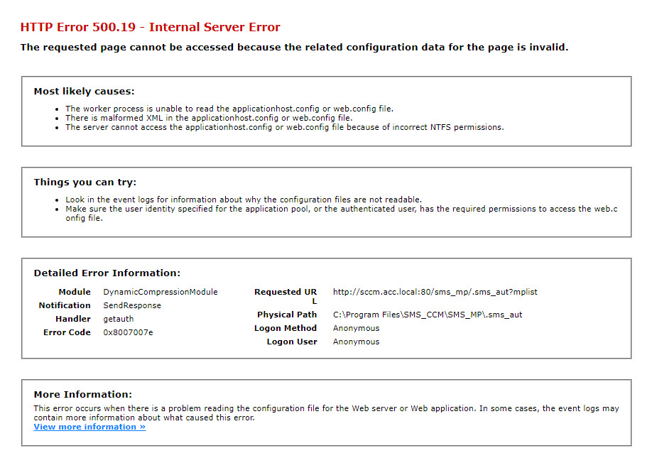
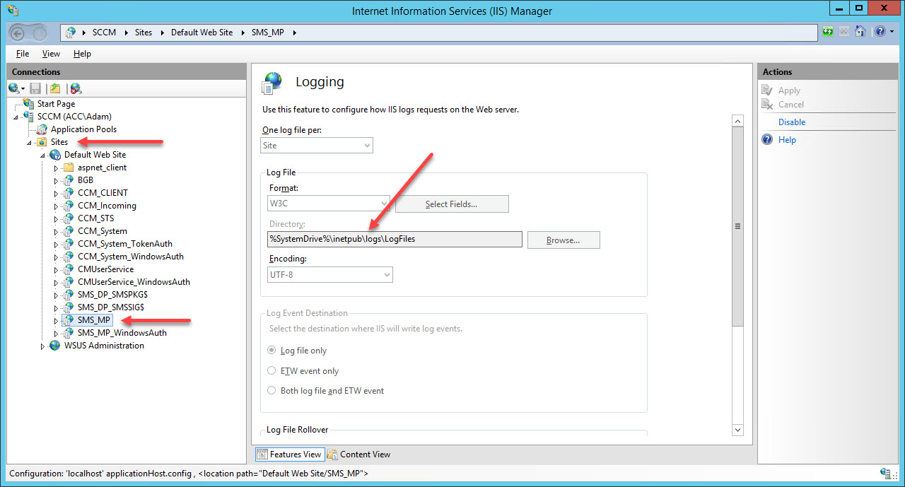

My lab recently started playing up when I noticed clients weren't receiving any new policies.

TDLR (it's not even that long!): a while ago I moved my SUP/WSUS off host from the site server that also hosted a MP. As a result it seemed to have triggered this known issue: [Management points stop responding to HTTP requests with error 500.19](https://support.microsoft.com/en-gb/help/4468361/management-points-stop-responding-to-http-requests-with-error-500-19).

First port of call was `CcmMessaging.log` to see it was at least talking to MP OK, and it wasn't:

```
Successfully queued event on HTTP/HTTPS failure for server 'SCCM.acc.local'.
Post to http://SCCM.acc.local/ccm_system_windowsauth/request failed with 0x87d00231.
[CCMHTTP] ERROR: URL=http://SCCM.acc.local/ccm_system/request, Port=80, Options=224, Code=0, Text=CCM_E_BAD_HTTP_STATUS_CODE
[CCMHTTP] ERROR INFO: StatusCode=500 StatusText=Internal Server Error
Raising event: instance of CCM_CcmHttp_Status {ClientID = "GUID:A5FB49C2-955B-43EC-AE78-2BBB289FFD0F";DateTime = "20190722130543.131000+000";HostName = "SCCM.acc.local";HRESULT = "0x87d0027e";ProcessID = 4496;StatusCode = 500;ThreadID = 1340; };
Successfully queued event on HTTP/HTTPS failure for server 'SCCM.acc.local'.
Post to http://SCCM.acc.local/ccm_system/request failed with 0x87d00231.
```

Poking around server-side in the MP logs gave me a bit of a red herring with this in `MP_Status.log`:

```
CMPDBConnection::Init(): IDBInitialize::Initialize() failed with 0x80004005	
=======================================	
MPDB ERROR - CONNECTION PARAMETERS
SQL Server Name     : SCCM.acc.local\SCCM_LOCALHOST
SQL Database Name   : CM_ACC
Integrated Auth     : True
MPDB ERROR - EXTENDED INFORMATION
MPDB Method         : Init()
MPDB Method HRESULT : 0x80004005
Error Description   : Login timeout expired
OLEDB IID           : {0C733A8B-2A1C-11CE-ADE5-00AA0044773D}
ProgID              : Microsoft SQL Server Native Client 11.0
MPDB ERROR - INFORMATION FROM DRIVER
null	
=======================================
Certificate for client GUID:D125CE68-1CAD-4AED-9759-5ECF3842932C is revoked	
Mp Status: Failed ProcessKnownProperties, error 80004005	
MP Status: processing failed for 1 event(s)	
MP StatusForwarder (the event processor) reported an error 80004005
```

Opening up in the browser on the server hosting the MP gave me a 500.19 status code when testing MP connectivity with `http://<ServerName.FQND>/sms_mp/.sms_aut?mplist`.



Another place to find more information of HTTP status codes for web requests is the web server's logs! You can find where your MP's logs are stored by:

1. Opening `Internet Information Services (IIS) Manager`
2. Expand `Sites` node
3. Expand `Default Web Site` node
4. Select `SMS\_MP` node
5. Double click logging and observe the value in the `Directory` field



Log snippet:

```
...
2019-07-22 13:11:58 192.168.175.11 CCM_POST /ccm_system_windowsauth/request - 80 - 192.168.175.16 ccmhttp - 401 2 5 1357 189
2019-07-22 13:12:32 192.168.175.11 PROPFIND /CCM_Client - 80 - 192.168.175.16 ccmsetup - 500 19 126 1357 21
2019-07-22 13:12:32 192.168.175.11 PROPFIND /CCM_Client - 80 - 192.168.175.16 ccmsetup - 500 19 126 1357 53
...
```

Some slightly reworded Googling thankfully landed me here: [Management points stop responding to HTTP requests with error 500.19](https://support.microsoft.com/en-gb/help/4468361/management-points-stop-responding-to-http-requests-with-error-500-19):

1. Locate  `%windir%\system32\inetsrv\config`.
2. Open the `applicationHost.config` file in Notepad.
3. Look for an entry that resembles the following:  
```
<scheme name="xpress" doStaticCompression="false" doDynamicCompression="true" dll="C:\Windows\system32\inetsrv\suscomp.dll" staticCompressionLevel="10" dynamicCompressionLevel="0" />`
```
4. Remove the XPress compression schema by running the following command from an elevated command prompt:  
```
%windir%\system32\inetsrv\appcmd.exe set config -section:system.webServer/httpCompression /-[name='xpress']
```
5. Verify that the compression schema is removed from the **applicationHost.config** file, and then save the file.
6. Run the following command from an elevated command prompt:  

```
iisreset
```
