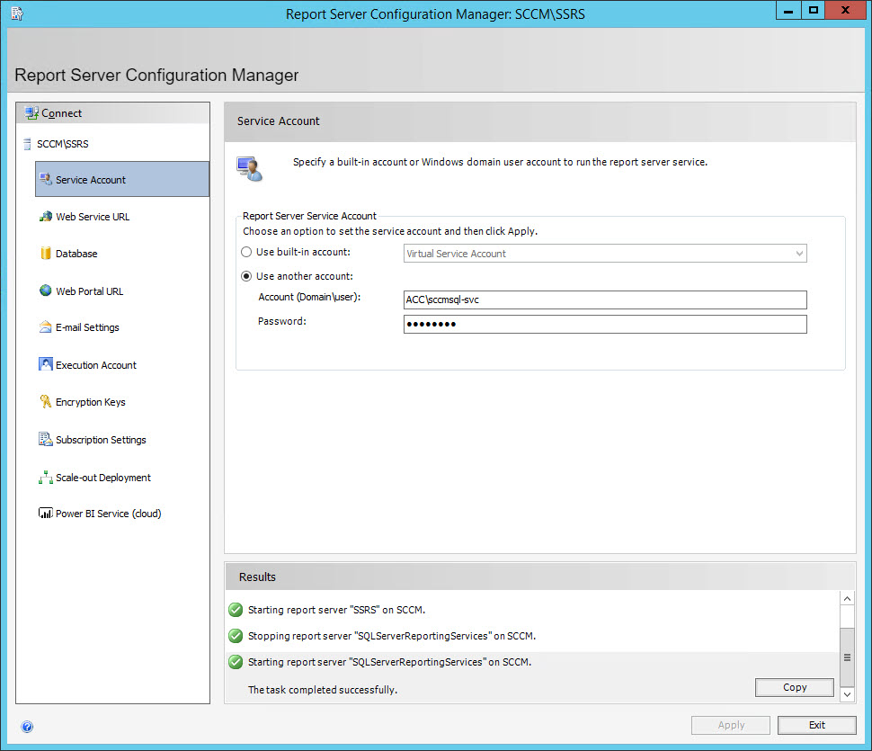

Currently my lab's primary site is running on 2012 R2. I recently wanted to try LEDBAT so I could sell it to a customer but it needed to be on 2016 or newer. I could have configured a 2016 "source DP" using pull distribution points and still get the experience, but then I was curious if IPU while ConfigMgr is installed was possible, [turns out it is](https://docs.microsoft.com/en-us/sccm/core/servers/manage/upgrade-on-premises-infrastructure). Then I discovered I had SQL 2012 SP2 installed! So I bumped it to SP4. Then I thought, why not go to 2017?

I've applied service packs to SQL for ConfigMgr before but never a major release upgrade. Turns out, it's straight forward!

These are the resources I found useful and guided me:

- [Hardware and Software Requirements for Installing SQL Server](https://docs.microsoft.com/en-us/sql/sql-server/install/hardware-and-software-requirements-for-installing-sql-server?view=sql-server-2017) - Microsoft
- [Supported Version and Edition Upgrades](https://docs.microsoft.com/en-us/sql/database-engine/install-windows/supported-version-and-edition-upgrades?view=sql-server-2017) - Microsoft
- [Supported SQL Server versions for Configuration Manager](https://docs.microsoft.com/en-us/sccm/core/plan-design/configs/support-for-sql-server-versions) - Microsoft
- [Configuring reporting in System Center Configuration Manager](https://docs.microsoft.com/en-us/sccm/core/servers/manage/configuring-reporting) - Microsoft
- [Upgrading your SCCM site database](https://sccmentor.com/2016/10/03/upgrading-your-sccm-site-database/) - Paul Winstanley
- [SCCM 1606 Upgrade SQL Server 2014 To SQL Server 2016](https://www.prajwaldesai.com/sccm-1606-upgrade-sql-server-2014-sql-server-2016/) -Prajwal Desai
- [Patching SQL Server with SCCM](https://sccm-zone.com/patching-mssql-with-sccm-fee8583eb6b6) - Octavian Cordos
- [The Complete Guide for SCCM Server Migration Part 1 – SQL 2017](https://www.anoopcnair.com/complete-guide-sccm-server-migration-part-1-sql-2017/) - Rajul OS

## Overview

We'll migrate custom reports, remove the Report Services Point role, install SSRS 2017, upgrade to SQL Server 2017, reinstall the Report Services Point role, and finally talk about anti-virus exclusions and new CE levels for your ConfigMgr db.

Please don't hate my SQL instance name. I started the environment off trying out a ConfigMgr database move so at the time I wanted the instance name to be distinctively different!

## SQL Server Reporting Services Upgrade

SSRS is now a separate installer and the installation of SQL Server 2017 will remove any bundled SSRS components you have installed.

So, how do we handle our current reports and ReportServer database?

### Report migration

If you google "sql reporting services migration" you'll quickly learn many people have had a stab at this. Below are a few I've put together, though honestly, if you have a handful, just export the .rdl files manually and be done with it.

- [Craig Porteous](https://www.sqlshack.com/migrating-ssrs-content-powershell/) has a great write up talking about various ways to tackle this, strongly encourage you to read the post. Be sure to check out his method of tackling the problem using mostly PowerShell and the [dbatools](https://dbatools.io/) module.
- [Reporting Services Migration Tool](https://www.microsoft.com/en-gb/download/details.aspx?id=29560) which is Microsoft's own attempt at being a solution, made back in 2012 and not been touched since. As Craig mentions in his post, it's written in PoSH and by default the target instance must be a SharePoint integrated instance - apparently easily modifiable to point to a regular SQL instance.
- [RS.exe ssrs\_migration.rss script](https://docs.microsoft.com/en-us/sql/reporting-services/tools/sample-reporting-services-rs-exe-script-to-copy-content-between-report-servers?view=sql-server-2017) is another Microsoft attempt, which looks like a more recent attempt.
- [ReportSync](https://code.google.com/archive/p/reportsync/) which is an open source tool under MIT license, seemingly popular however it's old and unloved
- [SCCM Report Manager Tool](https://www.systemcenterdudes.com/sccm-reports-manager-tool/)

### Reporting Service Point role

> After you upgrade SQL Server, and SQL Server Reporting Services that is used as the data source for a reporting services point, you might experience errors when you run or edit reports from the Configuration Manager console. For reporting to work properly from the Configuration Manager console, you must remove the reporting services point site system role for the site and reinstall it. However, after the upgrade you can continue to run and edit reports successfully from an Internet browser.
> 
> [Configuring Reporting - Upgrading SQL Server](https://docs.microsoft.com/en-us/sccm/core/servers/manage/configuring-reporting#upgrading-sql-server) - Microsoft

With that in mind, you may as well remove the RSP role before you start. There's no harm in doing this after the upgrade, you'll just get a moaning RSP component in console is all because it can't start the SSRS service tied to the RSP that the install for SQL Server 2017 removed.

Checkout `srsrp.log`, `srsrpMSI.log`, `srsrpsetup.log` and `sitecomp.log` if there are any issues with this.

### Installing SSRS 2017

Once you've decided what you want to do with your custom reports and removed the Reporting Service Point role, we can start installing SSRS 2017. You'll need your SQL Server product key, check out [How to find the product key for SQL Server 2017 Reporting Services](https://docs.microsoft.com/en-us/sql/reporting-services/install-windows/find-reporting-services-product-key-ssrs?view=sql-server-2017).

   
   

After install for SSRS 2017 you'll have the option in configuration to create a new database or choose an existing one. As your current SSRS instance still exists you must create a new database with a unique name and also create a web service point with a unique name too.

> :information_source: **Note:** After entering data in any section ensure you hit `Apply` at the bottom.

   

    

     

## SQL Server Upgrade

Now we can get started upgrading the DB engine.

Start off by stopping and disabling all ConfigMgr services until we're ready. I disabled mine in case I needed to reboot and didn't want to run the risk of ConfigMgr running on an unsupported SQL backend in fear of the gremlins.

```powershell
$Services = "SMS_EXECUTIVE", "SMS_NOTIFICATION_SERVER", "SMS_SITE_BACKUP", "SMS_SITE_COMPONENT_MANAGER", "SMS_SITE_SQL_BACKUP", "SMS_SITE_VSS_WRITER", "CONFIGURATION_MANAGER_UPDATE"
ForEach ($Service in $Services) { 
    Write-Host "$($Service): $((Get-Service -Name $Service).StartType)"
    Stop-Service -Name $Service -Force 
    Set-Service -Name $Service -StartupType Disabled
}
```

### Installing SQL Server 2017

Run `setup.exe` in the installation media and work your way through the wizard:

     

     

I want to point out that I ran through this process three times and played hot potato with the "_Use Microsoft Update to check for updates (recommended)_" and I found it did not install any cumulative updates.

Restart :smile:

At this point I'm at RTM build number:

 

Which at the time of writing this, that is not supported for ConfigMgr. Minimum CU2 is needed for SQL Server 2017:


[Supported SQL Server versions for Configuration Manager](https://docs.microsoft.com/en-us/sccm/core/plan-design/configs/support-for-sql-server-versions) - Microsoft

Run through the CU wizard, for me this was CU 13 which took me to 14.0.3048:

      

Restart :smile:

Restore the services startup types back to what they were and do one more final reboot to ensure all needed services start normally:

```powershell
$Services = "SMS_EXECUTIVE", "SMS_NOTIFICATION_SERVER", "SMS_SITE_BACKUP", "SMS_SITE_COMPONENT_MANAGER", "SMS_SITE_SQL_BACKUP", "SMS_SITE_VSS_WRITER", "CONFIGURATION_MANAGER_UPDATE"
ForEach ($Service in $Services) {
    If (("SMS_NOTIFICATION_SERVER", "SMS_SITE_BACKUP") -contains $Service) { 
        Set-Service -Name $Service -StartupType Manual 
    } 
    Else {
        Set-Service -Name $Service -StartupType Automatic
    }
}
```

If there are issues with the site connecting to the database, you will most likely see messages of interest in:

|Log file name|Description|
|---|---|
|`smsprov.log`|Records WMI provider access to the site database.|
|`smsdbmon.log`|Records database changes.|
|`statmgr.log`|Records the writing of all status messages to the database.|

[Log files for troubleshooting](https://docs.microsoft.com/en-us/sccm/core/plan-design/hierarchy/log-files)

### Reinstall Report Services Point role

Now you should be good to go by adding back the RSP!

   

Again, checkout `srsrp.log`, `srsrpMSI.log`, `srsrpsetup.log` and `sitecomp.log` if there are any issues with this.

> :information_source: **Note:** Reports may take a little while to appear in console, you can monitor the progress of them being generated in `srsrp.log`.

## Post SQL upgrade tasks

### Antivirus exclusions

Slightly off-topic, but [bookmark this link](https://social.technet.microsoft.com/wiki/contents/articles/953.microsoft-anti-virus-exclusion-list.aspx) right now.

Back on-topic. This is somewhat obvious but can easily be forgotten: update your exclusion rules to reflect new paths for SQL Server + SSRS 2017!

- [Configuration Manager Current Branch Antivirus Exclusions](https://blogs.technet.microsoft.com/systemcenterpfe/2017/05/24/configuration-manager-current-branch-antivirus-update/) - Microsoft

### Cardinality Estimation

I recently saw a tweet by Umair Khan:

> 

The [referenced blog](https://techcommunity.microsoft.com/t5/configuration-manager-archive/configmgr-current-branch-1810-guidance-for-the-sql-ce-levels/ba-p/339962) post taught me what Cardinality Estimation is and what Umair's guidance means. I highly encourage you to read it if you've just updated from an old SQL version to 2017.

As a result you may want to update your ConfigMgr DB backend CE level to something like 140. As I upgraded away from 2012, my ConfigMgr DB and new ReportServer2017 DB was CE level was 110.

 

You can read up more on Cardinality Estimation and guidance on how to change your CE level here:

- [Cardinality Estimation (SQL Server)](https://docs.microsoft.com/en-us/sql/relational-databases/performance/cardinality-estimation-sql-server?view=sql-server-2017) - Microsoft

## Final comments

I started off with SSRS first before SQL Server because I didn't want anyone following this post having removed their SSRS instance with a boat load of custom reports without realising the impact. I figured if I made the needed warnings first then it would be safer for you.

The added benefits of doing SSRS after SQL upgrade is, I guess, are:

- the CE level for ReportServer DB would default to latest
- the ability to use the current web URLs and maybe even database name too, if you're brave enough to delete/rename the original
