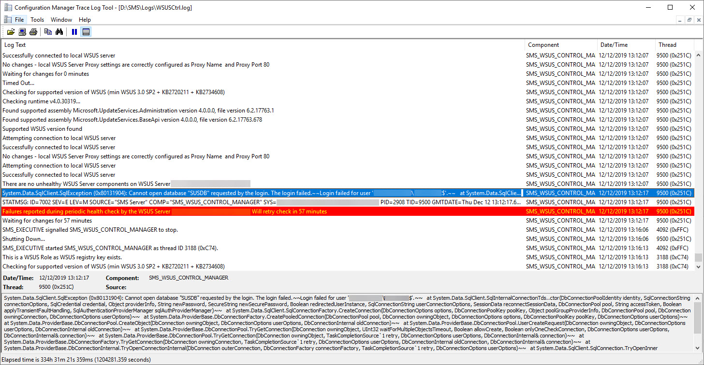

First post as MEMCM rather than SCCM. I think since my last post in July I've accumulated a dozen unfinished drafts but you know, I've been having too much fun.. working.

I recently stood up a remote SUP with its own WSUS role and SQL database. What I didn't realise was, even though it was still syncing updates from the upstream SUP/WSUS server just fine, the status messages for the SMS\_WSUS\_CONTROL\_MANAGER component on the new SUP/WSUS box was coughing up a bunch of errors ever since I installed the roles and configured them:

```
Failures were reported on WSUS Server "server.domain.com" while trying to make WSUS database connection with SQL Server Exception error code -2146232060.

Possible cause: SQL Server service is not running or cannot be accessed.
Solution: Verify that the SQL Server and SQL Server Agent services are running and can be contacted.
```

WSUSCtrl.log on the new remote SUP/WSUS box was thankfully giving me more juice:

```
System.Data.SqlClient.SqlException (0x80131904): Cannot open database "SUSDB" requested by the login. The login failed.~~Login failed for user 'DOMAIN\SERVER$'.~~  ...
```



And again in Event Viewer under the Application log:

```
Log Name:      Application
Source:        MSSQLSERVER
Date:          12/12/2019 11:59:34
Event ID:      18456
Task Category: Logon
Level:         Information
Keywords:      Classic,Audit Failure
User:          SYSTEM
Computer:      SERVER.domain.com
Description:
Login failed for user 'DOMAIN\SERVER$'. Reason: Failed to open the explicitly specified database 'SUSDB'. [CLIENT: fe80::442f:d8a1:6d2e:757%3]
Event Xml:
<Event xmlns="http://schemas.microsoft.com/win/2004/08/events/event">
  <System>
    <Provider Name="MSSQLSERVER" />
    <EventID Qualifiers="49152">18456</EventID>
    <Level>0</Level>
    <Task>4</Task>
    <Keywords>0x90000000000000</Keywords>
    <TimeCreated SystemTime="2019-12-12T11:59:34.450122600Z" />
    <EventRecordID>10164</EventRecordID>
    <Channel>Application</Channel>
    <Computer>SERVER.domain.com</Computer>
    <Security UserID="S-1-5-18" />
  </System>
  <EventData>
    <Data>DOMAIN\SERVER$</Data>
    <Data> Reason: Failed to open the explicitly specified database 'SUSDB'.</Data>
    <Data> [CLIENT: 0000::0000:0000:0000:000$0]</Data>
    <Binary>184800000E000000090000004400430045002D0043004D00300032000000070000006D00610073007400650072000000</Binary>
  </EventData>
</Event>
```

```
Log Name:      Application
Source:        SMS Server
Date:          12/12/2019 11:59:34
Event ID:      7002
Task Category: SMS_WSUS_CONTROL_MANAGER
Level:         Error
Keywords:      Classic
User:          N/A
Computer:      SERVER.DOMAIN.com
Description:
On 12/12/2019 11:59:34, component SMS_WSUS_CONTROL_MANAGER on computer SERVER.DOMAIN.com reported:  Failures were reported on WSUS Server "SERVER.DOMAIN.com" while trying to make WSUS database connection with SQL Server Exception error code -2146232060.

Possible cause: SQL Server service is not running or cannot be accessed.
Solution: Verify that the SQL Server and SQL Server Agent services are running and can be contacted.
Event Xml:
<Event xmlns="http://schemas.microsoft.com/win/2004/08/events/event">
  <System>
    <Provider Name="SMS Server" />
    <EventID Qualifiers="49152">7002</EventID>
    <Level>2</Level>
    <Task>78</Task>
    <Keywords>0x80000000000000</Keywords>
    <TimeCreated SystemTime="2019-12-12T11:59:34.450122600Z" />
    <EventRecordID>10165</EventRecordID>
    <Channel>Application</Channel>
    <Computer>SERVER.DOMAIN.com</Computer>
    <Security />
  </System>
  <EventData>
    <Data>SERVER.DOMAIN.com</Data>
    <Data>-2146232060</Data>
    <Data>On 12/12/2019 11:59:34, component SMS_WSUS_CONTROL_MANAGER on computer SERVER.DOMAIN.com reported:  </Data>
  </EventData>
</Event>
```

## Solution

I checked out SQL permissions on the instance and on the SUSDB database and it appeared the local group "SERVER\\WSUS Administrators" (which contains NT AUTHORITY\\SYSTEM) is present with necessary permissions (at least when comparing with another SUP/WSUS server).

On the instance's security logins ( Databases > Security > Logins), I saw NT AUTHORITY\\SYSTEM was listed. Out of curiosity, I gave it a mapping to the SUSDB and restarting the SMS\_WSUS\_CONTROL\_MANAGER proved to be successful.

1. Open SQL Server Management Studio
2. Connect to the SQL instance
3. Expand Databases, Security and then Logins
4. Right click on NT AUTHORITY\\SYSTEM and choose Properties
5. Under User Mappings, select the SUSDB database from the central pane and delegate the "public" and "webService" role membership.
6. From the ConfigMgr console, open the [Configuration Manager Service Manager](https://docs.microsoft.com/en-us/configmgr/core/servers/deploy/configure/site-components#BKMK_ServiceMgr) and cycle the SUP's SMS\_WSUS\_CONTROL\_MANAGER.
