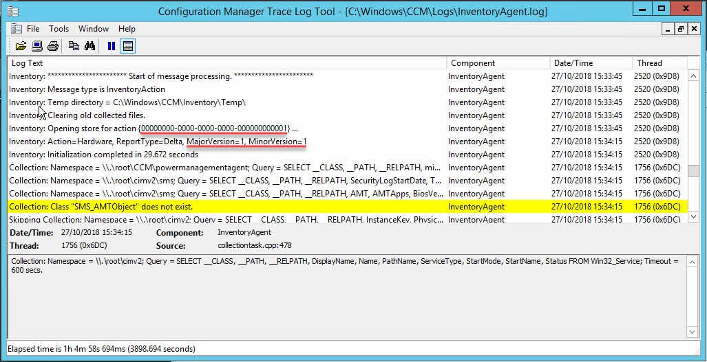
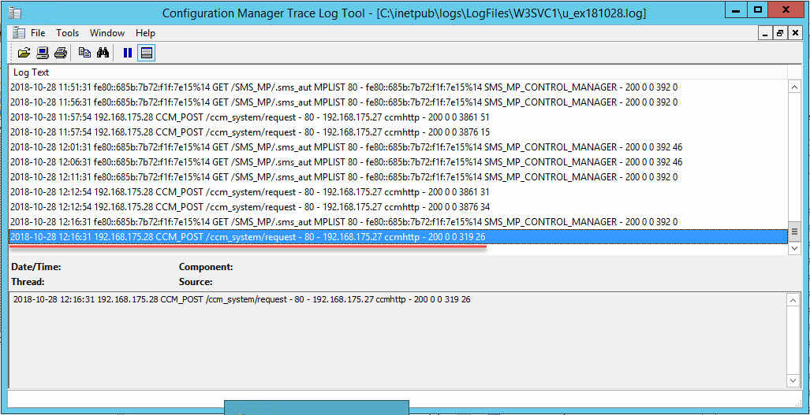
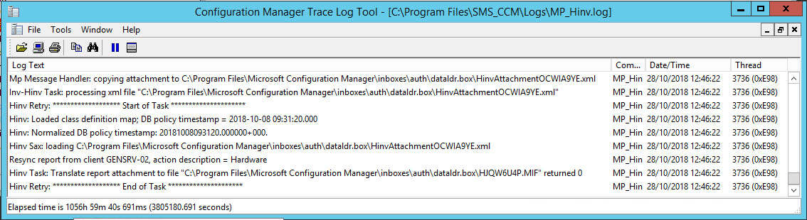
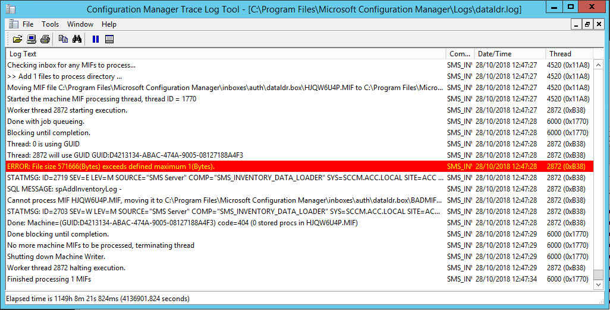

I've recently updated a site to 1806 and was keen to get all clients up to date too. Some machines targeted for the pre-production client were not upgrading. When I looked closer at one client I suspected client health because a hardware inventory had not been submitted in months.

Little did I know until recently, a lack of recent hardware inventory data could be a result of other things and client health is least likely to be the root cause. Instead of blindly reinstalling or manually upgrading the client, I wanted to try and understand what's going on.

If you're concerned about client health look at [Anders Rodland's ConfigMgr Client Health script](https://www.andersrodland.com/configmgr-client-health/).

There are great articles already out there on this topic, here's some I used to help me with this issue:

- [Hardware Inventory – In-Depth (Part 1)](https://blogs.technet.microsoft.com/scotts-it-blog/2015/04/23/hardware-inventory-in-depth-part-1/)
- [Updated – Troubleshoot ConfigMgr Hardware Inventory Issues](https://www.enhansoft.com/blog/updated-troubleshoot-configmgr-hardware-inventory-issues)
- [Troubleshooting SCCM ..Part II (Hardware Inventory)](https://blogs.technet.microsoft.com/sudheesn/2010/05/31/troubleshooting-sccm-part-ii-hardware-inventory/)
- [Solved: Troubleshooting Hardware Inventory in SCCM | Step By Step Guide](https://thesysadminchannel.com/troubleshooting-hardware-inventory-sccm-full-guide/)

From the above I understood the problem could be:

- Broken WMI repository on the client
- BITS on the client is failing to POST the data to the MP
- The INVENTORY_DATA_LOADER (?) refusing to handle the MIF because perhaps:
  - bad syntax
  - mismatch in versions
  - too big as it exceeds the MAX FILE SIZE

## Client side

First port of call was InventoryAgent.log on the client. This log file records activity on the client about hardware and software inventory processes and heartbeat discovery. At the start of the cycle you will see the log tell us which action its performing and whether it's a full, delta and resync report.

Action | Guid
--- | ---
Hardware inventory | {00000000-0000-0000-0000-000000000001}
Software inventory | {00000000-0000-0000-0000-000000000002}
Data Discovery Record (DDR) | {00000000-0000-0000-0000-000000000003}
File collection | {00000000-0000-0000-0000-000000000010}



Looking at InventoryAgent.log above you can see:

- The hardware inventory action took place by looking at the GUID
- The MajorVersion and MinorVersion; MajorVersion increments with every full or resync report and the MinorVersion increments with every delta report.
  - Full is triggered for the initial report
  - Delta is triggered for each hardware inventory after the full
  - Resync is triggered when either the client recognises there's a mismatch in report versions when comparing what has previously been executed, or when SMS_INVENTORY_DATA_LOADER compares what the client has sent compared to what's in the site database

You can manually trigger a delta by running the Hardware Inventory Cycle in the Control Panel applet, however consider running the below if you want to force a full report. Also consider using [Recast's Right Click Tools](https://recastsoftware.com/) which gives you this option from the console.

```powershell
Get-CimInstance -Namespace "root\ccm\invagt" -ClassName "InventoryActionStatus" | 
    Where-Object { $_.InventoryActionID -eq "{00000000-0000-0000-0000-000000000001}" } | 
        Remove-CimInstance

$InvokeCimMethodSplat = @{
    ComputerName = $env:COMPUTERNAME
    Namespace = "root\ccm"
    Class = "SMS_Client"
    Arguments = @{
        TriggerSchedule = "{00000000-0000-0000-0000-000000000001}"
    }
}

Invoke-CimMethod @InvokeCimMethodSplat
```

Going back to the problem I was troubleshooting... I was confident WMI was healthy because I could see various areas of WMI being successfully queried and at the end of the cycle I saw "Inventory: Successfully sent report. Destination:mp:MP_HinvEndpoint...". After seeing that, I figured let's look server side.

## Server side

The three key areas server side in this scenario are:

- SMSINVENTORY_DATA_LOADER - dataldr.log
- Management Point - MP_hinv.log
- IIS - C:\inetpub\logs\LogFiles  - This is the default location for IIS logs, if everything else is default, your SCCM IIS logs should be in a sub folder named W3SVC1. You can find out yourself by looking in IIS Manager.

In all three of the above, I could not see any reference of the machine's name, IP or GUID.

## Back to the client

Looking back at the client, I could see a big queue of BITS job with mixed states: suspended, queued, error and transient_error. You can view the current BITS jobs using the below commands:

CMD

```
bitsadmin /list /allusers
```

PowerShell

```powershell
Get-BitsTransfer -AllUsers
```

Get more information about the reason why they're failing with:

CMD

```
bitsadmin /info JOBID /verbose
```

PowerShell

```powershell
Get-BitsTransfer -JobId JOBID | Select-Object *
```

To reset all BITS jobs... You will notice most of the jobs are owned by SYSTEM or NETWORK SERVICE, of which commands you run in any other context will not be successful at purging. A workaround could be to create a scheduled task that runs as SYSTEM to run either of the below:

CMD

```
bitsadmin /reset /allusers
```

PowerShell

```powershell
Get-BitsTransfer -AllUsers | Remove-BitsTransfer
```

However, an easier way posted by [Nickolaj Andersen](http://www.scconfigmgr.com/2014/03/28/how-to-reset-bits-transfer-queue/) works well:

```cmd
net stop BITS 
ipconfig /flushdns 
ren "%ALLUSERSPROFILE%\Application Data\Microsoft\Network\Downloader\qmgr0.dat" qmgr0.dat.old 
ren "%ALLUSERSPROFILE%\Application Data\Microsoft\Network\Downloader\qmgr1.dat" qmgr1.dat.old
net start BITS
```

For me, my problem was proxy related. I could see error messages referencing timeouts as the issue, I got this by looking at the verbose BITS jobs information.

After fixing that and clearing all jobs, I triggered another full hardware inventory report and quickly saw the BITS job leave the client with no hang ups.

## Back to the server

Starting off with the IIS logs I saw successful POST from the client, so data uploaded OK.



Next, I want see how the management point handles the report. In the below you can see that it successfully receives it in XML form and parses it into a MIF file, ready to then be parsed by the SMS_INVENTORY_DATA_LOADER and submitted in to the site database. Here, I had no issues.



However I had issues with SMS_INVENTORY_DATA_LOADER. Nothing too complicated though, the MIF was just too big than the allowed MIF size. I guess where its a mature server, been in production in a while, accumulated a lot of "things", as well as whatever additional hardware classes is configured client settings for hardware inventory. And the fact it's a full report.

The below suggests my maximum allowed size is 1 byte, this was true just for the purpose of creating this screenshot.



On the primary site server I increased `HKLM\Software\Microsoft\SMS\Components\SMS_INVENTORY_DATA_LOADER\Max MIF Size`. The decimal value is in bytes so set it to a value at your discretion, your best gauge is see how far over the limit you are by observing the error in dataldr.log and add a little more. Then restart the SMS_INVENTORY_DATA_LOADER component in Configuration Manager Service Manager (Monitoring > Component Status > Right click any component > Start > Configuration Manager Service Manager).

Then, some time later, the hardware scan timestamp for the device in the console updated and I could see the new data in the device's Resource Manager.

I felt this was worth writing up because while the links I shared at the start cover most of what I've written, I wanted to show that BITS is a factor - the other posts don't touch on this - and use it as a note for me in future. You may find you'll only hit one or two of these issues when troubleshooting hardware inventory, unlikely to be all of them in one go like I almost did.
