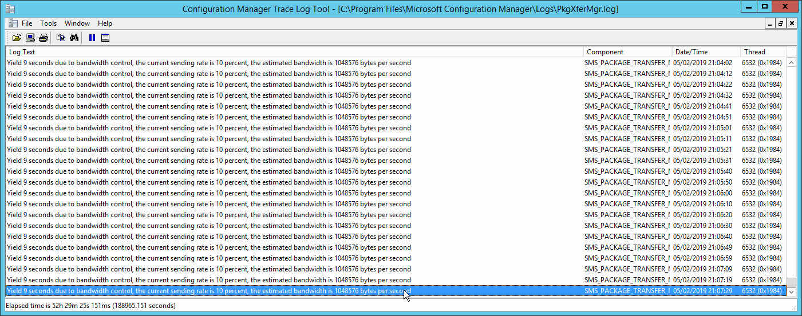

> :information_source: It looks like as I was writing this Microsoft have just publicly released a former internal document detailing some things that I had claimed to be undocumented ([click here](https://support.microsoft.com/en-us/help/4482728/understand-troubleshoot-content-distribution-in-configuration-manager)):
> 

In this post I'll cover ways you can control bandwidth for Configuration Manager using the rate limit config available for each distribution point. Outside of rate limits, a modern approach to traffic shaping content distribution to DPs is LEDBAT. [Read this great write up](https://deploymentresearch.com/Research/Post/657/LEDBAT-with-ConfigMgr-Pure-Love-By-Daniel-Olsson) by [Daniel Olsson](https://deploymentresearch.com/Research/Post/657/LEDBAT-with-ConfigMgr-Pure-Love-By-Daniel-Olsson) for more LEDBAT info in this use case.

How familiar are you with the difference between the options "pulse mode" and "limited to specified maximum transfer per hour"? I wasn't sure up until recently, and like me you may have misunderstood the % you're applying for each hour slot, when you may want pulse mode instead.

## Pulse mode

Pulse mode is simple. Pump out x sized data block every y seconds. Unfortunately, the maximum data block size is 256KB - enabling you to set a maximum cap of 2Mbps - so I support ['Increase block size for pulse mode (distribution point rate limit)'](https://configurationmanager.uservoice.com/forums/300492-ideas/suggestions/36773581-increase-block-size-for-pulse-mode-distribution-p), do you?

## Limited to specified maximum transfer per hour 

As for "limited to specified maximum transfer per hour"... Turns out the % you apply for each hour is strictly relevant to how long for Configuration Manager can send using 100% available bandwidth, following by the how long Configuration Manager will not transmit data for, during that hour slot. The [documentation](https://docs.microsoft.com/en-us/sccm/core/servers/deploy/configure/install-and-configure-distribution-points#bkmk_config-rate) explains this well.

However it does not explain the behaviour. For example, if you configured it to be 50/50, does this mean it's pumping content flat out for 30 consecutive minutes of the hour and dead quiet for the other 30 conseuctive minutes? Perhaps that's too much detail to care for and simply knowing that the DP will go full-pelt for 50% of the hour is good enough for you. But I was curious.

In my lab, I set a distribution point's "limit to specified maximum transfer per hour" to 10%. On the SCCM VM I set a bandwidth maximum limit of 10Mbps, in Hyper-V this is only for outbound traffic but that's OK it's what I'm testing. The bandwidth limit is mostly so I can transfer a 12GB package and make it run for long enough to watch what's going on. 

With perfmon I wanted to cover 3600 seconds, and being limited to just 1000 samples, I could only go down to 1 sample every 4 seconds. 

  

After a few minutes of watching perfmon, task manager and resource monitor, it became clear that perfmon's graph is not a true reflection. While it shows the behaviour, but it doesn't show that Configuration Manager was actually pulsing at 10Mbps (or near abouts). The perfmon graph, and the calculations made by
SMS_PACKAGE_TRANSFER_MANAGER seemed to be perfectly time so perfmon could not plot/sample the peak of each pulse.

I could have covered fewer seconds and sampled every 1 second and maybe caught the pulses in the graph. But the demonstration was to monitor the behaviour for the configured hour slot. So no, I wanted to look at the results for the last hour.

From the above two log file snippets, I've learnt that SMS_PACKAGE_TRANSFER_MANAGER:

- Determines current available bandwidth capacity
- By knowing the current available bandwidth capacity, calculate when the next pulse will be, while still satisfying the config applied by admin (in my case, 10%)

So it's not black and white like I first thought, e.g. flat out for 10% of the hour and quiet for the remainder. From what I've learnt I appreciate the current behaviour is probably most ideal; it doesn't create prolonged periods of congestion.

With the current limitation of pulse mode (256KB block size), using this config could enable you to create a greater average. However, for brief moments of time during the hour you may still saturate bandwidth at either end causing spikes of latency – albeit for a second, not even that.

## No concurrent transfers to a distribution point while it has any rate limit defined

Something you may also not be aware of is the behaviour of SMS_DISTRIBUTION_MANAGER when you configure any rate limit.

The [documentation](https://docs.microsoft.com/en-us/sccm/core/servers/deploy/configure/install-and-configure-distribution-points#bkmk_config-rate) doesn't yet say this, and I gave feedback, but when you configure any rate limit – whether pulse mode or the other – only one package will transfer at a time to that distribution point. Anything you had configured in the properties for the Software Distribution Component will be ignored.

It's not a huge unknown. If you're experienced then you may have known this already. However I have
(at the time of writing this) three years experience and I had no idea. I only discovered it while learning about the “limited to specified maximum transfer per hour” discussed in last section from a [great write up here](https://www.experts-exchange.com/articles/12177/SCCM-2012-How-Rate-Limiting-Pulse-Mode-saved-the-day.html) by [Chris Nienabar](https://twitter.com/sccmcanuck).

## Software Distribution Component

This brings me on to the two relevant options in the Software Distribution Component.

Where are the properties for the Software Distribution Component? Administratrtion > Sites > select your site > Configure Site Components > Software Distribution Components

The two key options here are **Maximum number of packages** and **Maximum threads per package**. This is what [the documentation](https://docs.microsoft.com/en-us/sccm/core/servers/deploy/configure/site-components#software-distribution) has to say about it:

> On the General tab, specify settings that modify how the site server transfers content to its distribution points. When you increase the values you use for concurrent distribution settings, content distribution can use more network bandwidth.

I don't want to come across like I'm hating on Microsoft's documentation because [I see this dude's tweets](https://twitter.com/AaronCzechowski) and I can tell hard work goes in to making things as great as they are. But hopefully I'll have an opportunity here to further explain these two options, probably moreso the second than the first:

**Maximum number of packages**: The number of packages that can be concurrently push.

**Maximum threads per packages**: The number of distribution points that the distribution manager can concurrently push content to.

The defaults are 3 and 5, so in effect it means you can transfer 3 packages to 5 distribution points concurrently.
