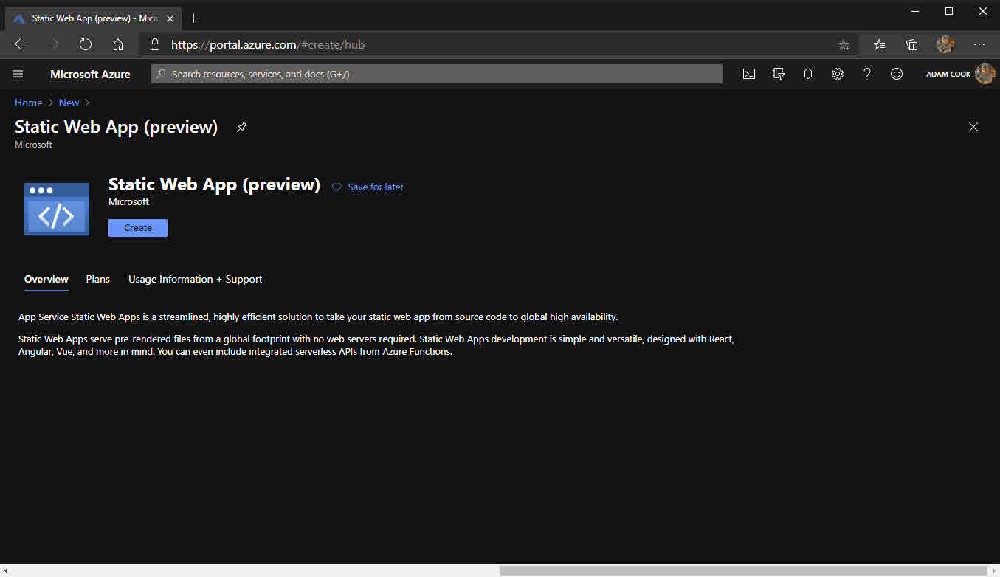

- [What is this Hugo thing?](#what-is-this-hugo-thing)
- [Prerequisites](#prerequisites)
- [Azure Static Web Apps](#azure-static-web-apps)
- [Azure Blob storage](#azure-blob-storage)
- [GitHub pages](#github-pages)

I will be touching on a little about Hugo and why I like it. I am also going to show you three ways to deploy your Hugo websites: with Azure Static Web Apps (preview), Azure Blob storage and GitHub pages.

## What is this Hugo thing?

Hugo is a static site generator. 

_continues to stare blankly at the screen_

Yeah, I did too. 

With static site generators (like Hugo), you forego caring about databases and any kind of code. Instead, your HTML pages are generated either each time a user visits your website, or in Hugo's case, the HTML pages are generated each time you create or update content.

Instead of writing your pages and blog posts in HTML files or in feature-rich WYSIWYG editors on some bloated content management system (WordPress), you write them in markdown (at least you do with Hugo). Then you invoke the process to generate the HTML files, using your new markdown content as source. The generated HTML files land in a very particular directory (`/public`). After that, all you need to do is get that directory on a hosting solution as your web root. Done.

When it comes to styling, themes are mostly plug and play, too. Fancy a new theme? No problem. [Download one](https://themes.gohugo.io/) and drop it in the `/themes` directory, update `config.toml` a little. Donezo.

If no runtime is needed to run your website, other than something which is capable of offering HTML files over HTTP, not only does this opens up your hosting opportunities, performance is also another great benefit. You do not need a hosting package that sits on nginx or Apache, running PHP or whatever. For example, you can host on [Azure Blob storage](https://azure.microsoft.com/en-gb/services/storage/blobs/) or [GitHub pages](https://pages.github.com/).

GitHub pages is free. It also lets you use your own domain and offers free SSL certificates via LetsEncrypt. Azure Blob Storage isn't quite free but it is pennies. It is £0.0144 per GB (in UK South) of storage and the first 5GB of bandwidth from this zone is free. You can do this on many more platforms too, such as Amazon S3, Netlify, Heroku, GitLab Pages, Google Cloud Storage and more.

I am all-for ditching WordPress. I really do not want to pay for hosting any more. Over the last few years I have grown more comfortable with Git and working on Azure and GitHub. If you relate to that or are enticed by any of the benefits listed above, I highly recommend you at least give it a go!

Here are some resources I used to learn Hugo:

- [Hugo - Static Site Generator | Tutorial](https://www.youtube.com/watch?v=qtIqKaDlqXo&list=PLLAZ4kZ9dFpOnyRlyS-liKL5ReHDcj4G3) YouTube series
- [Hugo Quick Start](https://gohugo.io/getting-started/quick-start/) official documentation

## Prerequisites

Before we get started, I am going to assume some things:

- You have an Azure subscription
- You have a GitHub account and repository
- The repository contains either only your static site content, or the whole Hugo directory with your latest generated content in the `/public` directory
- You get by with Git enough to be able to do things like committing/pushing - doesn't have to be command line, GitHub Desktop is totally fine!

## Azure Static Web Apps

Let us start with deploying Hugo to an Azure Static Web App. [Earlier this year Microsoft announced Azure Static Web Apps](https://techcommunity.microsoft.com/t5/apps-on-azure/introducing-app-service-static-web-apps/ba-p/1394451) and it's currently in preview. While it's in preview, this resource is free. 

It boasts "deep GitHub integration", which is true. When you create the resource and associate a GitHub repository with it, it creates a GitHub Actions workflow YAML file in your repository. It also stores a secret in the repository. The secret is used by the workflow to authenticate to Azure. This build process ships everything that's in the `/public` directory up to a Blob container in Azure using said secret. It also takes care of creating a static website for you from the blob storage and also offers you free LetsEncrypt SSL certificates.

The good thing about using Azure Static Web Apps is that you essentially get Azure Blob storage and Azure Functions bundled in to one resource. This enables you to leverage the speed and flexibility of static site generators, while still being able to implement some dynamic abilities in to your website by rolling your own API via Azure Functions.

1. Log in to the [Azure portal](https://portal.azure.com)
2. Create a new Static Web App resource
3. Fill out the typical information ie resource group, name and region
4. Sign in to GitHub
5. Choose organisation / user, repository and branch
6. For the build details, ensure you choose Hugo and that you have the `App artifact location` set to `public`
7. Click `Review + create` and once validation succeeds, click `Create`

 

Once the Static Web App resource is provisioned in Azure you will notice it created the GitHub Actions workflow YAML file in your repository. We can see from looking in the workflow file that it is using the [Azure/static-web-apps-deploy](https://github.com/Azure/static-web-apps-deploy) action.

[Here's the link](https://docs.microsoft.com/en-us/azure/static-web-apps/github-actions-workflow) referenced in the screenshot below for documentation to the action used in the workflow.

 

At this point, you will be able to see your static website live available from a HTTPS endpoint.

 

1. To use your own domain, go to your DNS provider set a CNAME record for `www`, or any subdomain you want, to your `azurestaticapps.net` URL as shown in your portal.
2. After that, configure the static web app resource to point to your domain.

 

Now your Hugo generated static website is deployed in Azure using Static Web Apps!

## Azure Blob storage

Moving on to hosting your Hugo website on Azure Blob storage.

There's no fancy automation here. Azure Blob storage does not integrate with your GitHub repository. It also does not create a workflow for you, or automatically create the static website. There is also no bundled Azure Functions resource so you can not roll your own API. Also, if you want the same CI/CD experience as with Azure Static Web Apps, you must roll your own workflow. But that is OK! Because I will share with you mine!

Why bother using it then if it is inferior? I guess while Static Web Apps are in preview, even though Microsoft will give you 30 days notice, they could start charging you an unpredictable rate to use it. Whereas Blob storage is here now, and its pricing is predictable. Maybe you also have your own reasons to prefer Blob storage.

As previously mentioned, at the time of writing this it is £0.0144 per GB in UK South for Blob storage. Although you must be careful, because while the first 5GB is free, what if your website starts receiving a lot of malicious attention? For that reason, I put Cloudflare in front of mine and I will show you how too.

1. Log in to the [Azure portal](https://portal.azure.com)
2. Create a new Azure Storage account
3. Fill out the necessary information and click the usual `Review + create` and `Create` after validation

 

4. Enable the storage account to be a static website
5. Set your blob container's access policy to `Container`
6. Custom domain ... Update your CNAME record in Cloudflare to point to the... use storagepssouthcouk.z33.web.core.windows.net, not the other one... thanks to this: https://github.com/MicrosoftDocs/azure-docs/issues/15781

- Cost
- GitHub actions

## GitHub pages

- 500MB limit on GitHub repositories
