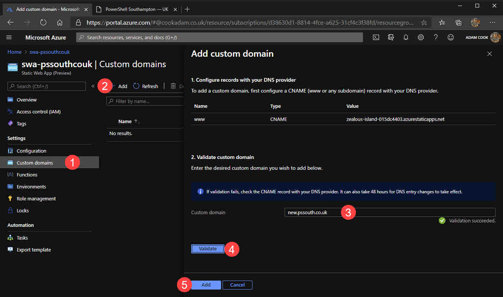

- [What is this Hugo thing?](#what-is-this-hugo-thing)
- [Prerequisites](#prerequisites)
- [Azure Static Web Apps](#azure-static-web-apps)
- [Azure Blob storage](#azure-blob-storage)
- [GitHub pages](#github-pages)
- [That is a wrap](#that-is-a-wrap)

I recently migrated my WordPress blogging platform to generating static content with Hugo. I no longer pay for hosting. I exclusively use GitHub pages. I am now blogging at no extra cost other than domain renewal!

In the process not only did I learn about Hugo, but I also looked at three ways to deploy / host my Hugo-made website.

In this post I want to share with you what Hugo is, why I like it and those three ways that I learned on how to deploy a Hugo website - with Azure Static Web Apps (preview), Azure Blob storage and GitHub pages.

For Azure Static Web Apps and Blob storage, I will be using Cloudflare. I am also assuming you will be using your own domain name. It is not a big deal if you do not want to, just ignore details focused on defining custom domains and creating CNAME records.

## What is this Hugo thing?

Hugo is a static site generator. 

_continues to stare blankly at the screen_

Yeah, I did too. 

With static site generators (like Hugo), you forego caring about databases and any kind of code. Instead, your HTML pages are generated either each time a user visits your website, or in Hugo's case, the HTML pages are generated each time you create or update content.

Instead of writing your pages and blog posts in HTML files or in a feature-rich WYSIWYG editor, on some bloated content management system like WordPress, you write them in markdown (at least you do with Hugo). Then you invoke the process to generate the HTML files, using your new markdown content as source. The generated HTML files land in a very particular directory (`public`). After that, all you need to do is get that directory on a web hosting platform as your web root.

When it comes to styling, themes are mostly plug and play, too. Fancy a new theme? No problem. [Download one](https://themes.gohugo.io/), drop it in the `/themes` directory amd update `config.toml` a little.

With static websites, no runtime is needed to run your website. Not only does this open up your hosting opportunities, performance is also another great benefit. You do not need a hosting package that sit on nginx or Apache, running PHP or whatever. For example, you can host on [Azure Blob storage](https://azure.microsoft.com/en-gb/services/storage/Blobs/) or [GitHub pages](https://pages.github.com/).

GitHub pages is free. It also lets you use your own domain and offers free SSL certificates via LetsEncrypt. Azure Blob Storage isn't quite free but it costs pennies. It is £0.0144 per GB (in UK South) of storage and the first 5GB of bandwidth from this zone is free. You can do this on many more platforms too, such as Amazon S3, Netlify, Heroku, GitLab Pages, Google Cloud Storage and more.

I am all-for ditching WordPress. Over the last few years I have grown more comfortable with Git and working on Azure and GitHub. If you relate to that or are enticed by any of the benefits, I highly recommend you at least give it a go! I would be more than happy to help, too, just get hold of me.

Here are some resources I used to learn Hugo:

- [Hugo - Static Site Generator | Tutorial](https://www.youtube.com/watch?v=qtIqKaDlqXo&list=PLLAZ4kZ9dFpOnyRlyS-liKL5ReHDcj4G3) YouTube series
- [Hugo Quick Start](https://gohugo.io/getting-started/quick-start/) official documentation

## Prerequisites

Before we get started, I am going to assume some things:

- You have an Azure subscription
- You have a GitHub account and repository
- The repository contains either only your static site content, or the whole Hugo directory with your latest generated content in the `public` directory
- You get by with Git enough to be able to do things like committing/pushing

## Azure Static Web Apps

Let us start with deploying Hugo to an Azure Static Web App. [Earlier this year Microsoft announced Azure Static Web Apps](https://techcommunity.microsoft.com/t5/apps-on-azure/introducing-app-service-static-web-apps/ba-p/1394451) and it's currently in preview. While it's in preview, this resource is free!

It boasts "deep GitHub integration", which is true. When you create the resource and associate a GitHub repository with it, it creates a GitHub Actions workflow YAML file in your repository. It also stores a secret in the repository. The secret is used by the workflow to authenticate to Azure. This workflow, when triggered by pushing to the master branch, ships everything in the `public` directory up to the Azure Static Web App for you. 

The good thing about using Azure Static Web Apps is that you essentially get Azure Blob storage and Azure Functions bundled in to one resource. This enables you to leverage the speed and flexibility of static site generators, while still being able to implement some dynamic abilities in to your website by rolling your own API via Azure Functions.

1. Log in to the [Azure portal](https://portal.azure.com)
2. Create a new Static Web App resource
3. Fill out the typical information ie resource group, name and region
4. Sign in to GitHub
5. Choose your organisation / user, repository and branch
6. For the build details, ensure you choose `Hugo` and that you have the "App artifact location" set to `public`
7. Finalise the resource creation via `Review + create` and if validation succeeds, click `Create`

 

Once the Static Web App resource is provisioned you will notice it created the GitHub Actions workflow YAML file in your repository. We can see from looking in the workflow file that it is using the [Azure/static-web-apps-deploy](https://github.com/Azure/static-web-apps-deploy) action. [Here's the link](https://docs.microsoft.com/en-us/azure/static-web-apps/github-actions-workflow) to the docs for said action.

 

At this point, you will be able to see your static website live available from a HTTPS endpoint.

 

8. To use your own domain, go to your DNS provider set a CNAME record for `www`, or any subdomain you want, to your `azurestaticapps.net` URL as shown in your portal.
9. After that, configure the static web app resource to point to your domain.

 

Now your Hugo generated static website is deployed in Azure using Static Web Apps!

## Azure Blob storage

Moving on to hosting your Hugo website on Azure Blob storage instead.

Now... Azure Blob storage does not do everything Azure Static Web Apps does. There is a reasonable amount of configuration to do yourself. For example, the Blob storage account is not configured to be a static website by default. There is also no bundled Azure Functions resource to integrate your own API. If you want the same CI/CD experience as with Azure Static Web Apps, you must also roll your own workflow with GitHub Actions (or similar). But that is OK! Because I will share with you my GitHub Actions workflow!

Why bother using it then? I guess while Static Web Apps are in preview, even though Microsoft will give you 30 days notice, they could start charging you an unpredictable rate to use it. Whereas Blob storage is a mature generally available service, its pricing model is known and it is very cost effective. Maybe you also have your own reasons to prefer Blob storage.

1. Log in to the [Azure portal](https://portal.azure.com)
2. Create a new Azure Storage account
3. Fill out the necessary information and click the usual `Review + create` and `Create` after validation

 

4. Within the "Static website" blade, enable the storage account to be a static website. Also define your index and error documents to be`index.html` and `404.html`.
5. Within the "Containers" blade, select the `$web` container and from the top menu change its access level via the "Change access level" menu item. Set its access policy to `Container`.
6. Within the "Custom domain" blade, enter your custom domain and copy the domain which ends with `z33.web.core.windows.net`. This will be used used to configure your CNAME record. Before clicking Save for your new custom domain, you will need to create a CNAME record with your DNS provider.
7. Head over to [Cloudflare](https://cloudfoare.com) and configure a CNAME record pointing to the `z33.web.core.windows.net` domain gathered from the last step. 
8. Wait a little bit (a couple of minutes?), then back in the "Custom domain" blade of the Azure portal, click Save and the domain should validate OK.

 
 

At this point, all there is left to do is to upload some content to your new Blob storage `$web` container. 

As a mess-around, create a file named `index.html` locally with some simple HTML in it which we'll use for testing shortly. Install [Azure Storage Explorer](https://azure.microsoft.com/en-us/features/storage-explorer/) and sign in with your Azure AD account with the subscription that holds your new storage account.

```html
<html>
    <body>
        <h1>Hello world</h1>
    </body>
</html>
```

Upload `index.html` to the `$web` container and check it out! It's worth pointing out that the [Azure Storage Visual Studio Code extension](https://marketplace.visualstudio.com/items?itemName=ms-azuretools.vscode-azurestorage) lets you modify files directly in your Blob container.

 

What we really want to do is to get the similar CI/CD pipeline going on like we had with Static Web Apps.

9. Within the "Shared access signature" blade of the storage account, generate a SAS connection string with the same permissions as below screenshot. Set the start/expiration date to suit your needs. 
10. Make note of the `Connection string` at the bottom.
11. From the Settings of your GitHub repository, create a secret named `AZURE_STORAGE_BLOB_SAS_CONNECTIONSTRING`.

 

12. Create a file in your repository named `azure-blob-storage.yml` (or whatever you want, it really doesn't matter, must be `.yml` though) in `.github\workflows` directory (that does matter, it must live in there). Use the below to populate to populate its contents.

```yaml
name: Azure Storage Blob Container CI/CD

on:
  push: 
    branches:
      - master

jobs:
  deploy:
    runs-on: ubuntu-latest
    steps:
      - uses: actions/checkout@v2
        with:
          submodules: true
      
      - name: Get Hugo
        uses: peaceiris/actions-hugo@v2
        with:
          hugo-version: '0.76.3'
          extended: true

      - name: Build
        run: hugo

      - name: Azure Blob Upload
        uses: bacongobbler/azure-blob-storage-upload@v1.1.1
        with:
          connection_string: ${{ secrets.AZURE_STORAGE_BLOB_SAS_CONNECTIONSTRING }}
          source_dir: public
          container_name: $web
          sync: true
```

13. Commit and push to your master branch.

Watch the status of the GitHub action at `https://github.com/YOUR_USERNAME/YOUR_REPO/actions`. If it ran successfully without any errors, you will see your Hugo website live at your domain!

If you want to make any more changes to your website, that's OK! With the above workflow in your repo, every time you commit to master, the workflow will be triggered and it will upload everything that gets created in the `public` directory within the runner to your `$web` container.

## GitHub pages

Last but definitely not least is [GitHub pages](https://pages.github.com/). I think this is probably my favourite because it is [the simplest to create](https://docs.github.com/en/free-pro-team@latest/github/working-with-github-pages/creating-a-github-pages-site) and absolutely free. 

[Hugo also has some excellent docs](https://gohugo.io/hosting-and-deployment/hosting-on-github/) on deploying to GitHub pages. They suggest a reasonable idea where we have two repositories for our static website, instead fo one. One contains your Hugo sources, and another - which is added as a Git submodule - holds our Hugo generated HTML content. The former would be a repository named whatever you want, for example `<username>.github.io-hugo`, whereas the latter would be named `<username>.github.io`.

1. Create your repository named `<username>.github.io`
2. Go to the Settings of your repository
3. Enable GitHub pages by choosing your branch (`master`) and folder (`/`). 
4. Optionally enter your custom domain

If you do enter a custom domain:, follow my prior instructions to [configures a CNAME record](https://docs.github.com/en/free-pro-team@latest/github/working-with-github-pages/managing-a-custom-domain-for-your-github-pages-site) that points to `<username>.github.io`. Also create a file `static/CNAME` in your Hugo sources containing only your domain, [read more here](https://gohugo.io/hosting-and-deployment/hosting-on-github/).

1. Check the box to `Enforce HTTPS` however note that this really does take ~24 hours to generate the certificate.

 

5. Create another repository that will contain our Hugo sources, named something like `<username>.github.io-hugo`
6. Clone your `<username>.github.io-hugo` repository to your computer and copy all of your Hugo content in to it, excluding the `public` directory

```
PS C:\git> git clone https://github.com/USERNAME/USERNAME.github.io-hugo.git
```

7. Change directory in to cloned repository and add our `<username>.github.io` repository as a submodule in to the `public` directory

```
PS C:\git> cd USERNAME.github.io-hugo
PS C:\git\USERNAME.github.io-hugo> git submodule add -b master https://github.com/USERNAME/USERNAME.github.io.git public
```

8.  Invoke `hugo` to generate the static website in the `public` directory, create a null file `.nojekyll` in the `public` directory

```
PS C:\git\USERNAME.github.io-hugo> hugo
PS C:\git\USERNAME.github.io-hugo> $null>>public\.nojekyll
```

9. At this point, before we commit and push up to GitHub, issue `hugo server` within the `C:\git\USERNAME.github.io-hugo` directory and check out how things look locally by browsing to [http://localhost:1313](http://localhost:1313).
10.  If all looks good, commit and push while within both directories `C:\git\USERNAME.github.io-hugo` and `C:\git\USERNAME.github.io-hugo\public`.

## That is a wrap

I hope you found this helpful!

 If you have any questions or feedback, drop a comment below, ping me on Twitter or find me in the [WinAdmins Discord](https://winadmins.io) (my handle is @acc)!
