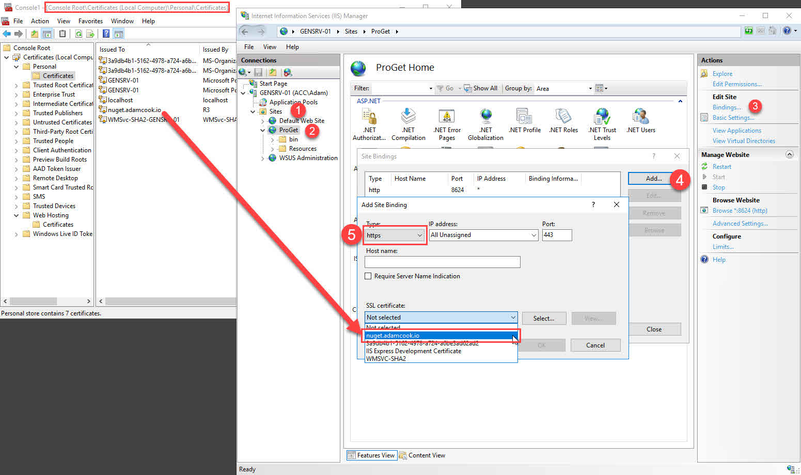
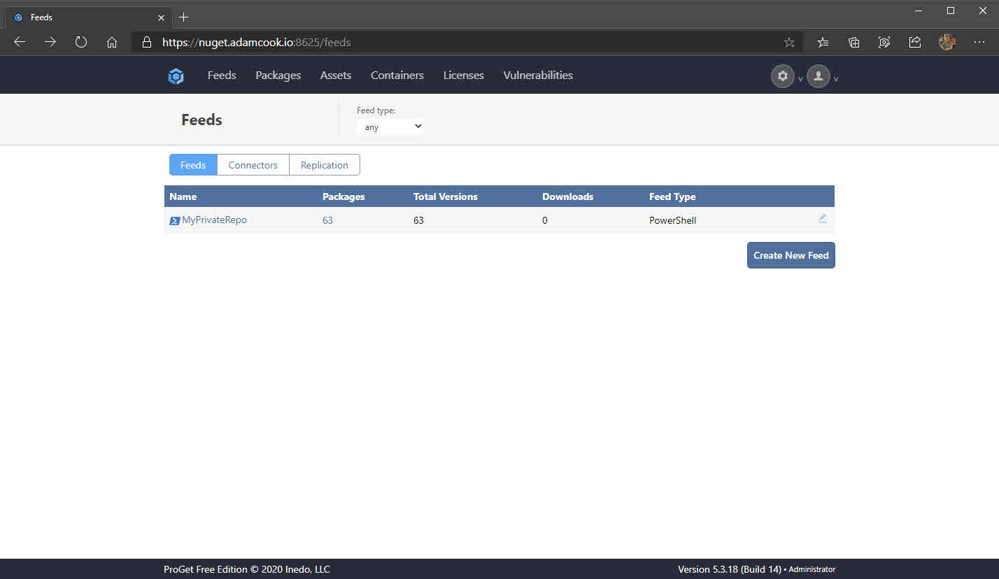
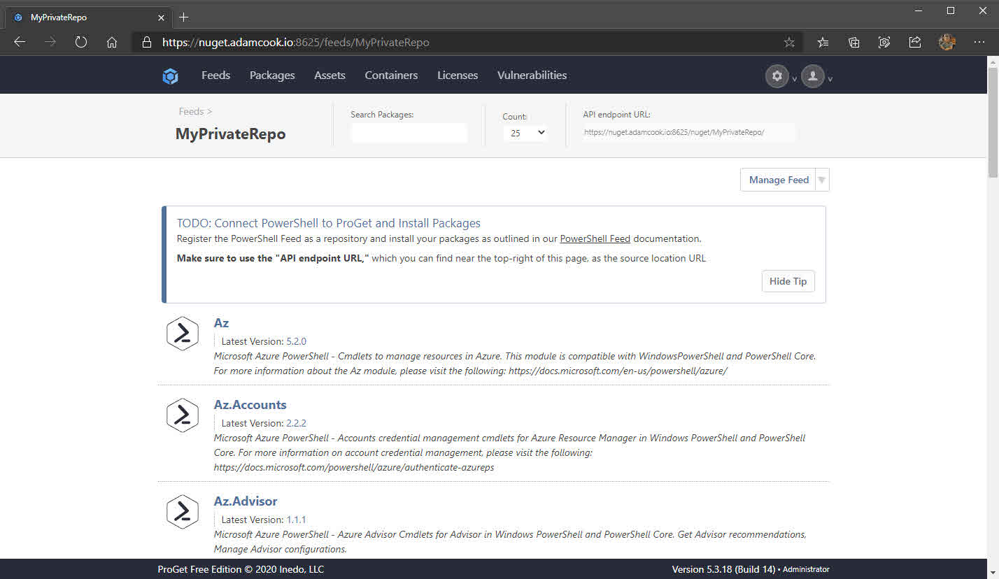
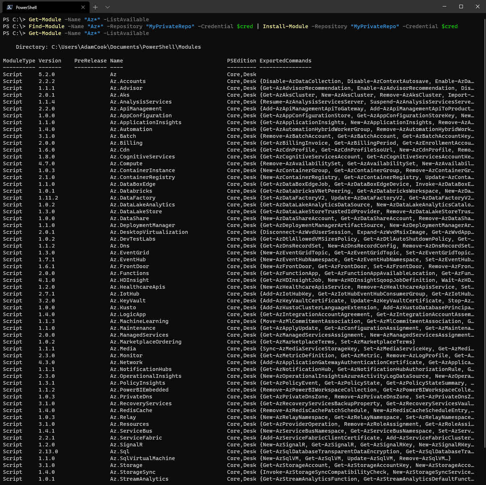

In this post I will share with you how to install [Inedo's ProGet](https://inedo.com/proget) to host your own NuGet feed (effectively your own PowerShell Gallery). This will let you share your own PowerShell modules/scripts amongst other systems/colleagues via cmdlets from the PowerShellGet module like `Install-Module`, `Install-Script`, `Find-Module`, `Find-Script` etc.

Why might you want to do this? Remember when PowerShell Gallery went down for a while in October? That's why. If you have workflows or any other need to access modules or scripts using any of the aforemention cmdlets, this is for you. By hosting your own, you can either be in full control of its availability (ProGet offers HA/cluster features) or maybe just treat it as a secondary source in the even of PowerShell Gallery going down.

There are already several posts which detail how to do this, but I could not find one which explained how to add an authentication layer when trying to pull packages. I wanted to authenticate using the `-Credential` parameter using e.g. `Install-Module`.

Here is what I will be covering in this post:

- [What is NuGet?](#what-is-nuget)
- [Installing ProGet](#installing-proget)
- [Create API key for publishing](#create-api-key-for-publishing)
- [Create user for downloading modules or scripts](#create-user-for-downloading-modules-or-scripts)
- [Create the PowerShell feed](#create-the-powershell-feed)
- [Configure ProGet to use HTTPS](#configure-proget-to-use-https)
- [Registering the feed on a system and publishing a test module](#registering-the-feed-on-a-system-and-publishing-a-test-module)
- [Installing modules or scripts from the feed](#installing-modules-or-scripts-from-the-feed)
- [Endpoint dependency requirements](#endpoint-dependency-requirements)
- [Alternatives to ProGet](#alternatives-to-proget)
- [Conclusion](#conclusion)

## What is NuGet?

Here I'll quickly breakdown why "NuGet" is a thing. It should give you an insight when trying to understand how or why it is relevant to PowerShell, especially when you're trying to effectively host your own PowerShell Gallery for internal/private consumption.

NuGet is a package management protocol developed by Microsoft. It was a protocol primarily intended for .NET packages on [NuGet.org](https://nuget.org). Developers for .NET use NuGet to pull their project's package dependencies from NuGet.org. This is very much like how PowerShell users use `Install-Module` from the PowerShell Gallery for their scripts, or dependencies for their PowerShell workflows.

NuGet is the binary which is behind the scenes to make commands like **[Install/Find]-[Module/Script]** pull content from the PowerShell Gallery, or other NuGet feeds e.g. your self-hosted one with products lik ProGet.

Microsoft leveraged the NuGet protocol for PowerShell's package/script/module management so they did not have to reinvent the wheel by producing and maintaining another package management system. 

I found the below 5 video YouTube series very insightful as it explains how/why it is used for .NET developers. Don't worry if you don't know .NET. All 5 videos will take about ~30 mins of your time. [Here is the playlist link](https://www.youtube.com/watch?v=WW3bO1lNDmo&list=PLdo4fOcmZ0oVLvfkFk8O9h6v2Dcdh2bh_).



Microsoft also have good documentation laying out what NuGet is and what it does:

- [What is NuGet and what does it do?](https://docs.microsoft.com/en-us/nuget/what-is-nuget)

## Installing ProGet

There is no place better than the horse's mouth (the vendor) to get guidance on installing their product. [Here it is](https://docs.inedo.com/docs/proget/installation/installation-guide). 

For this walk-through, I'll be using the below options in the ProGet installer:


- Choosing "Specify instance" gave me the "localhost" option. On this VM I have SQL Server installed. Choosing "Install Inedo Instance" installs SQL Express.
- I chose IIS as the web server, instead of the Integrated Web Server. You can later switch from the integrated web server to IIS later if you [following this doc](https://docs.inedo.com/docs/various/iis/switching-to-iis). It seems, at least at the time of writing this, they recommend IIS for load-balancing / HA config and also for configuring HTTPS.

After you've successfully installed ProGet and can see the web UI successfully load (default credentials are **Admin**/**Admin**, by the way), we need to lock it down a little bit. We will change the default credentials and remove the built-it Anonymous identity object access to all feeds.

1. Click the settings cog at the top right to access the settings and choose **Users & Tasks** under **Security & Authentication**
2. Click the **Admin** user and change the password to be something complex
3. Change to the **Tasks** tab and remove **Anonymous** from the task **Administer** and **View & Download Packages**


## Create API key for publishing

Seeing as we're currently in the settings, let's create an API key which will be needed for when we publish modules or scripts using the `Publish-Module` (or `Publish-Script`) cmdlets.

1. Go back to the settings via the cog at the top right, under **Integration & Extensibility** select **API Keys** and click **Create API Key**
2. Check the box which reads **Grant access to Feed API** and click **Save API Key**

## Create user for downloading modules or scripts

Now we will create a user which will be used for basic authentication in the `-Credential` parameter of cmdlets like `Find-Module`, `Find-Script`, `Install-Module` and `Install-Script` etc.

1. Again, work your way back to settings. This time click **Users & Tasks** and click **Create User**
2. Set the username and password and click **Save** (for this demo I've configured my username to be **someuser**)
3. Change to the **Tasks** tab and we will give the newly created user access to only **View & Download Packages** by clicking on **Add Permission**
4. Enter the user name created in step 2 in the **Principles** field and enter **View & Download Packages** in the **Tasks** field - don't forget to click **Save Privilege**

 

## Create the PowerShell feed

Good stuff, next we will create a new PowerShell feed which will contain our published modules and scripts.

1. Open the ProGet web UI by browsing to [http://localhost:8624](http://localhost:8624) and navigate to Feeds from the top navigation bar
2. Click **Create New Feed**


3. Scroll down and choose **PowerShell Modules** as the feed type
4. Give your feed a name and select the radio button which reads **Private/Internal packages**, click **Create New Feed**


## Configure ProGet to use HTTPS

You will need a web certificate which we will configure in IIS to use. As this is in my lab, things are like the wild west around here so I'm just going to yolo it with a LetsEncrypt certificate using the [Posh-ACME module](https://github.com/rmbolger/Posh-ACME).

1. Generate or obtain web certificate. Here I'll quickly demo how I do this with the Posh-ACME module.

```powershell
Install-Module "Posh-ACME"
Import-Module "Posh-ACMDE"
$Params = @{
    Domain = "nuget.adamcook.io"
    Contact = "myemail@address.com"
    DnsPlugin = "Cloduflare"
    PluginArgs = @{
        CFToken = ConvertTo-SecureString "MySuperSecretCloudflareAPIKey" -AsPlainText -Force
    }
}
New-PACertificate @Params
```

1. Load the certificate in the Local System's Personal or Web Hosting certificate store. If you used Posh-ACME, you will find the `.pfx` in **%LOCALAPPDATA%\Posh-ACME**. Simply right click, choose **Install PFX** and complete the wizard. The default password protecting the certificate is `poshacme`.
2. Open IIS and navigate through: **Sites** > **ProGet** > **Bindings** > **Add**
3. Change **Type** to **https**
4. By default the port is 443. If you have another site or service bound to this port on the host you're currently configuring, choose a different port. For this demo I chose port **8625**.
5. In the drop down for **SSL certificate** you should see our certificate



7. Click OK!
8. At this point you will need to make sure DNS is correctly configured for whatever domain you used for your certificate. All should be well once you can browse to the domain and not receive any certificate errors. For example:


## Registering the feed on a system and publishing a test module

At this point, you are good to go to start publishing scripts or modules to this feed. As an example, let's save a module from the PowerShell Gallery and publish it to our newly created NuGet feed.

For a laugh we'll demo with the `Az` module, which has 63 other dependent helper modules. As a result we will be downloading 63 modules from the PowerShell Gallery and publishing them all to our new self-hosted NuGet feed. 

1. Register the NuGet feed on your system using the below

I'll be honest.. I have no idea why we need to configure a package source before we can register the repository, but I couldn't get it to work otherwise. [More info here on that](https://github.com/OneGet/oneget/issues/403)!

```powershell
# Set the URL to match your config from the section 'Configure ProGet to use HTTPS'
# i.e. https/http, domain and port
$URL = "https://nuget.adamcook.io:8625/nuget/MyPrivateRepo" 
# Enter the username and password created from the section 
# 'Create user for downloading modules or scripts'
$Cred = Get-Credential

$Params = @{
	Name = "MyPrivateRepo"
	Location = $URL
	ProviderName = "NuGet"
	Credential = $Cred
	Trusted = $true
	SkipValidate = $true
}
Register-PackageSource @Params

$Params = @{
	Name = "MyPrivateRepo"
	SourceLocation = $URL
    PublishLocation = $URL
    ScriptSourceLocation = $URL
    ScriptPublishLocation = $URL
    PackageManagementProvider = "NuGet"
	Credential = $Cred
    InstallationPolicy = "Trusted"
}
Register-PSRepository @Params
```

You will notice that if you now run `Get-PackageSource` and `Get-PSRepository`, you will see our new NuGet repository. It is important to note that this is not a system-wide config, it is per-user. In other words, if you intend to register the package source and repository, and you want another security context on the same system the leverage this registration, you will need to register them in that context. [Here's a GitHub issue requesting this to change](https://github.com/PowerShell/PowerShellGet/issues/84).

2. Issue the following command to grab all of the modules and save them to `C:\temp\Az` locally

```powershell
Save-Module -Name "Az" -Path "C:\temp\Az"
```

> :information_source: If you receive an error along the lines of:
> > Failed to generate the compressed file for module 'C:\Program Files\dotnet\dotnet.exe failed to pack
> 
> Run the below. Close and re-open the console, then try again. [Credit](https://github.com/PowerShell/PowerShellGetv2/issues/303).
> ```powershell
> Invoke-WebRequest -Uri "https://dist.nuget.org/win-x86-commandline/latest/nuget.exe" -OutFile "$env:LOCALAPPDATA\Microsoft\Windows\PowerShell\PowerShellGet\NuGet.exe"
> ```

3. Using the API key we gathered from the section 'Create API key for publishing', we can now publish all the modules which are in the `C:\temp\Az` directory:

```powershell
Get-ChildItem -Path "C:\temp\Az" | ForEach-Object {
    Publish-Module -Path $_.FullName -NuGetApiKey "MySuperSecretAPIKey" -Repository "MyPrivateRepo"
}
```

4. After a couple of minutes, all of the modules will finish publishing. The web UI of ProGet will relfect this and we can also see this with `Find-Module` too. Don't forget, you will also need to use the `-Credential` parameter with `Find-Module`.

_Forgot what credential to use? It's the one we set from the section [Create user for downloading modules or scripts](#create-user-for-downloading-modules-or-scripts)._

  

Don't forget, you can still publish and install scripts to the NuGet feed just like you can with modules, using cmdlets like `Publish-Script`, `Find-Script` and `Install-Script`.

## Installing modules or scripts from the feed

Now let's demonstrate installing a PowerShell module from our new NuGet feed. 

1. If you're trying this from a different system compared to the last section, registery the package source and repository again as shown in the section [Registering the feed on a system and publishing a test module](#registering-the-feed-on-a-system-and-publishing-a-test-module). It is possible to omit the the `-ScriptPublishLocation` and `-PublishLocation` parameters if you do not intend to publish modules/scripts from the system(s) which you run these commands to register on.
2. Install all of the `Az*` modules. We need to make sure we explicitly specify our new NuGet feed using the `-Repository` parameter and the credential too using `-Credential`:

```powershell
$Modules = Find-Module -Name "Az*" -Repository "MyPrivateRepo" -Credential $Cred
$Modules | Install-Module -Repository "MyPrivateRepo" -Credential $cred
```

_Forgot what credential to use? It's the one we set from the section [Create user for downloading modules/scripts](#create-user-for-downloading-modules-or-scripts)._



## Endpoint dependency requirements

In order for other users to start using your new NuGet feed, you need to satisfy some pre-requisties. I strongly recommend you:

- All systems you intend to leverage the repository from have the latest available [PackageManagement](https://www.powershellgallery.com/packages/PackageManagement) and [PowerShellGet](https://www.powershellgallery.com/packages/PowerShellGet) modules installed
- If not already, get your environment using PowerShell 5.1 as it will make your life _alot_ easier. One of the biggest annoyances with older versions of PowerShell, at least this in context, is that they do not let you store multiple versions of a module. If you try to accomodate for older versions of PowerShell and try to manually deploy the PowerShellGet or PackageManagement modules, you will not have a good time. Take my advice and safe yourself the hassle and just upgrade to WMF 5.1.
- After the last two items are resolved, you then need to register the package source and repository on the endpoints you want to leverage the repository from. We did this in section [Registering the feed on a system and publishing a test module](#registering-the-feed-on-a-system-and-publishing-a-test-module).

Don't forget that the security context of which you register the package source and repository, is the only context in which the repositories are available. If you want to access the registered repository from another security context on the same system, you will have to re-register them in that context.

## Alternatives to ProGet

A bunch of other options besides ProGet: https://docs.microsoft.com/en-us/nuget/hosting-packages/overview

I'm not sure on authentication options via the `-Credential` parameter for any of the other applications.

## Conclusion

- If there was SAML / LDAP integration, could we pass AD creds with `-Credential` when configuring users' access to feeds? Get NFR key(s) to test