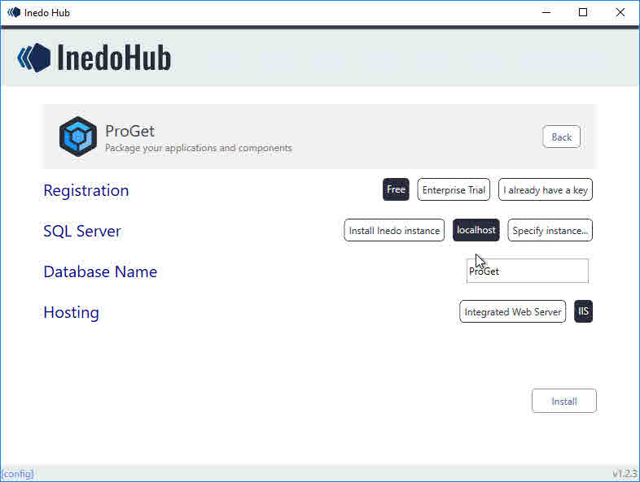
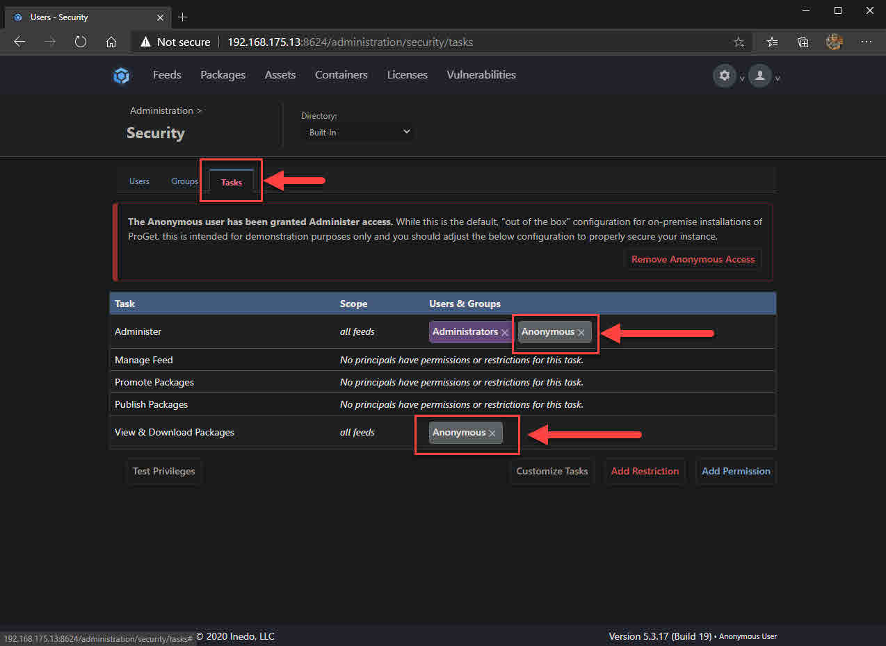
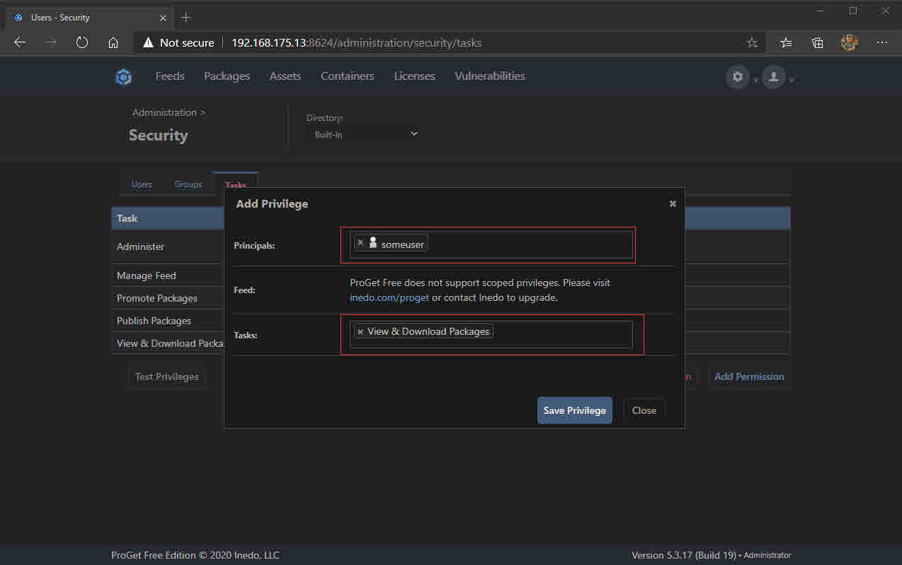
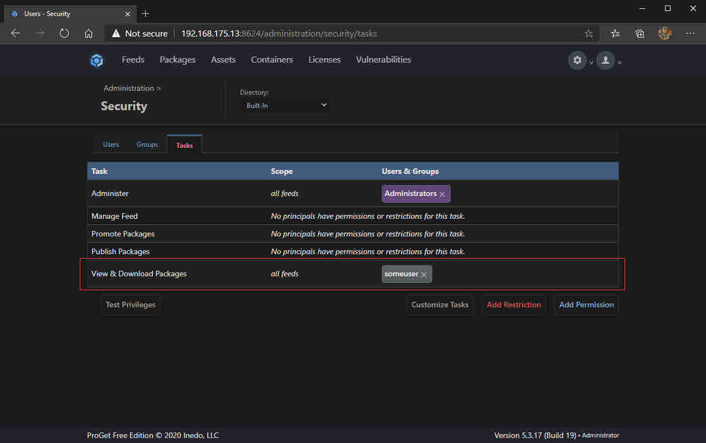
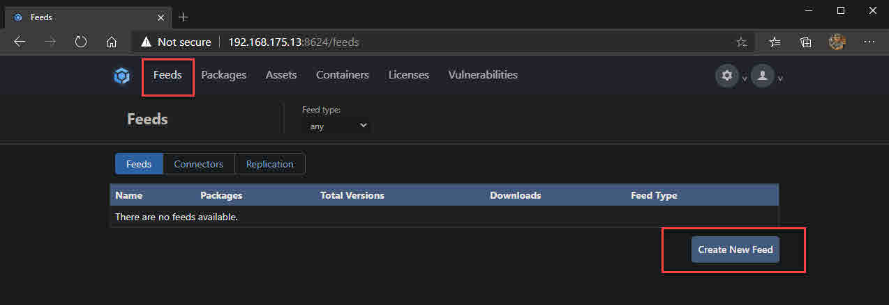
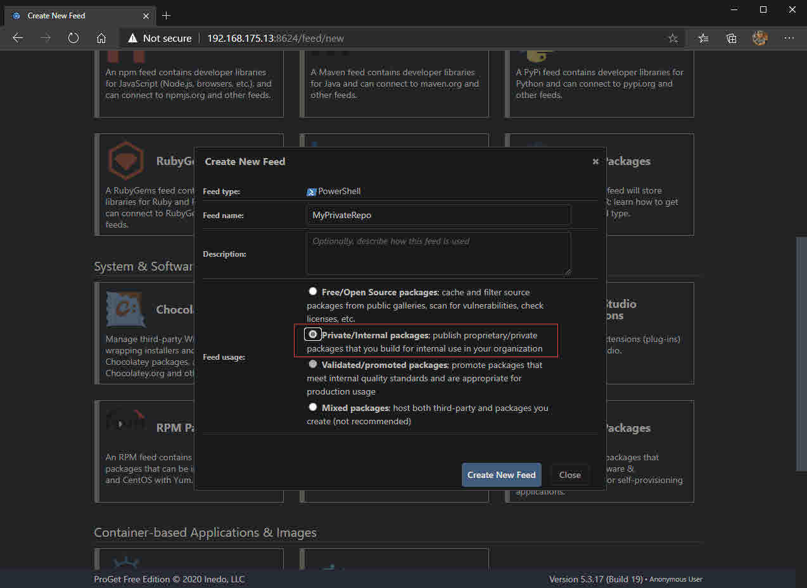

In this post I will share with you how to install [Inedo's ProGet](https://inedo.com/proget) to host your own NuGet feed. This will let you share your own PowerShell modules/scripts amongst other systems/colleagues via cmdlets from the PowerShellGet module like `Install-Module`, `Install-Script`, `Find-Module`, `Find-Script` etc.

There are already several posts which detail how to do this, but I could not find one which explained how to add an authentication layer when trying to pull packages. I wanted to authenticate using the `-Credential` parameter for each of the aforementioned cmdlets when pulling modules.

## What is NuGet?

Here I'll quickly breakdown why "NuGet" is a thing. It should give you an insight when trying to understand how or why it is relevant to PowerShell, especially when you're trying to effectively host your own PowerShell Gallery for internal/private consumption.

NuGet is a package management protocol developed by Microsoft. It was a protocol primarily intended for .NET packages on [NuGet.org](https://nuget.org). Developers for .NET used NuGet to pull their project's package dependencies from NuGet.org, much like how PowerShell users use `Install-Module` from the PowerShell Gallery for their scripts. 

NuGet is the binary which is behind the scenes to make commands like **[Install/Find]-[Module/Script]** pull content from the PowerShell Gallery, or other NuGet feeds e.g. your self-hosted one with products lik ProGet.

Microsoft leveraged the NuGet protocol for PowerShell's package/script/module management so they did not have to reinvent the wheel by producing and maintaining another package management system. 

I hope that has given you a little more insight and understanding as to why we see references to NuGet when it comes to PowerShell module/script package management.

I do not yet know any .NET, but I found the below 5 video YouTube series very insightful as it explains how/why it is used for .NET developers. All 5 videos will take about ~30 mins of your time. [Here is the playlist link](https://www.youtube.com/watch?v=WW3bO1lNDmo&list=PLdo4fOcmZ0oVLvfkFk8O9h6v2Dcdh2bh_).



Microsoft also have good documentation laying out what NuGet is and what it does:

- [What is NuGet and what does it do?](https://docs.microsoft.com/en-us/nuget/what-is-nuget)

## Installing ProGet

There is no place better than the horse's mouth (the vendor) to get guidance on installing their product. [Here it is](https://docs.inedo.com/docs/proget/installation/installation-guide). 

For this walk-through, I'll be using the below options in the ProGet (web, not offline) installer:

- Choosing "Specify instance" gave me the "localhost" option. On this VM I have SQL Server installed. Choosing "Install Inedo Instance" installs SQL Express.
- I chose IIS as the web server, instead of the Integrated Web Server. You can later switch from the integrated web server to IIS later if you [following this doc](https://docs.inedo.com/docs/various/iis/switching-to-iis). It seems, at least at the time of writing this, they recommend IIS for load-balancing / HA config and also for configuring HTTPS.

After you've successfully installed ProGet and can see the web UI successfully load (default credentials are **Admin**/**Admin**, by the way), we need to make it less open to all that can reach it. We will change the default credentials and remove the built-it Anonymous identity object access to all feeds.

1. Click the settings cog at the top right to access the settings and choose **Users & Tasks** under **Security & Authentication**
2. Click the **Admin** user and change the password to be something complex
3. Change to the **Tasks** tab and remove **Anonymous** from the task **Administer** and **View & Download Packages**

## Create API key for publishing

Seeing as we're currently in the settings, let's create an API key which will be needed for when we publish modules or scripts using the `Publish-Module` (or `Publish-Script`) cmdlets.

1. Go back to the settings via the cog at the top right, under **Integration & Extensibility** select **API Keys** and click **Create API Key**
2. Check the box which reads **Grant access to Feed API** and click **Save API Key**

## Create user for downloading modules/scripts

Now we will create a user which will be used for basic authentication in the `-Credential` parameter of cmdlets like `Find-Module`, `Find-Script`, `Install-Module` and `Install-Script` etc.

1. Again, work your way back to settings. This time click **Users & Tasks** and click **Create User**
2. Set the username and password and click **Save** (for this demo I've configured my username to be **someuser**)
3. Change to the **Tasks** tab and we will give the newly created user access to only **View & Download Packages** by clicking on **Add Permission**
4. Enter the user name created in step 2 in the **Principles** field and enter **View & Download Packages** in the **Tasks** field - don't forget to click **Save Privilege**

 

## Configuring your first PowerShell feed

Good stuff, next we will create a new PowerShell feed which will contain our published modules and scripts.

1. Open the ProGet web UI by browsing to [http://localhost:8624](http://localhost:8624) and navigate to Feeds from the top navigation bar
2. Click **Create New Feed**

3. Scroll down and choose **PowerShell Modules** as the feed type
4. Give your feed a name and select the radio button which reads **Private/Internal packages**, click **Create New Feed**

## Endpoint dependencies

- PackageManagement and PowerShellGet
- If not already, get your environment using PowerShell 5.1 as it will make your life _alot_ easier. One of the biggest annoyances with older versions of PowerShell, at least this in context, is that they do not let you store multiple versions of a module.

******ps
PS C:\> Register-PackageSource -Name "MyPackageSource" -Location "https://urlhere" -SkipValidate
PS C:\> Register-PSRepository ... -Credential
******
## Alternatives to ProGet

A bunch of other options besides ProGet: https://docs.microsoft.com/en-us/nuget/hosting-packages/overview

I'm not sure on authentication options via the `-Credential` parameter for any of the other applications.

## Conclusion

- If there was SAML / LDAP integration, could we pass AD creds with `-Credential` when configuring users' access to feeds? Get NFR key(s) to test