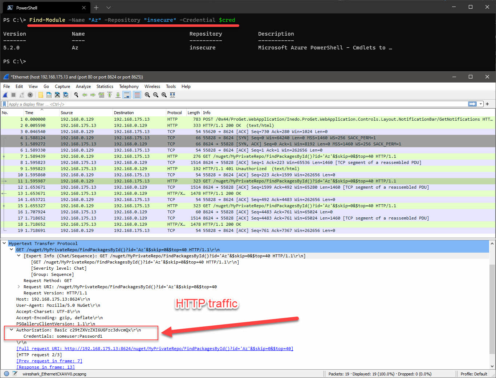

In this post I will share with you how to install [Inedo's ProGet](https://inedo.com/proget) to host your own NuGet feed (effectively your own PowerShell Gallery). This will let you share PowerShell modules and scripts amongst other systems and colleagues from an internal resource, using cmdlets from the PowerShellGet module e.g. `Install-Module`, `Install-Script`, `Find-Module`, `Find-Script` etc.

Why might you want to do this? Remember when PowerShell Gallery went down for a while in October? That's a pretty good reason. Another reason might be if you like or need the use of the PowerShellGet cmdlets when interacting with the PowerShell Gallery, but do not want to store your code publicly. 

By hosting your own, you can be in full control of its availability ([ProGet Enterprise](https://docs.inedo.com/docs/proget/administration/license) offers high-availability and load balancing features). Perhaps instead maybe you could treat it as a secondary source in the event of PowerShell Gallery going down.

What I wanted to do differently in this post, compared to others which I've seen cover installing ProGet, is that I wanted to add an authentication layer when trying to pull packages. In other words, I needed my NuGet feed to be widely open in terms of network access and because of that I wanted to protect it by requiring the `-Credential` parameter with cmdlets like `Install-Module`, `Find-Module` etc.

Here is what I will be covering in this post:

- [What is NuGet?](#what-is-nuget)
- [ProGet](#proget)
- [Installing ProGet](#installing-proget)
- [Create API key for publishing](#create-api-key-for-publishing)
- [Create user for downloading modules or scripts](#create-user-for-downloading-modules-or-scripts)
- [Create the PowerShell feed](#create-the-powershell-feed)
- [Configure ProGet to use HTTPS](#configure-proget-to-use-https)
- [Registering the feed on a system and publishing a test module](#registering-the-feed-on-a-system-and-publishing-a-test-module)
- [Installing modules or scripts from the feed](#installing-modules-or-scripts-from-the-feed)
- [Basic authentication](#basic-authentication)
- [Endpoint dependency requirements](#endpoint-dependency-requirements)
- [Conclusion](#conclusion)
- [Additional resources](#additional-resources)

## What is NuGet?

Here I'll quickly breakdown why "NuGet" is a thing. It should give you an insight when trying to understand how or why it is relevant to PowerShell, especially in this context of trying to host our own PowerShell Gallery.

NuGet is a package management protocol developed by Microsoft. It was intended for .NET packages on [NuGet.org](https://nuget.org). Developers for .NET use NuGet to pull their project's package dependencies from NuGet.org. This is very much like how PowerShell users use `Install-Module` from the PowerShell Gallery for their scripts, or dependencies for other PowerShell workflows.

NuGet is the binary which is behind the scenes of the PowerShellGet module to make commands like `Install-Module`, `Install-Script`, `Find-Module`, `Find-Script` etc pull content from the PowerShell Gallery, or other NuGet feeds e.g. your self-hosted one with products like ProGet.

It makes sense that Microsoft leveraged the existing NuGet protocol for PowerShell's package management (scripts and modules). Doing so means they did not have to reinvent the wheel by producing and maintaining another package management system. 

I found the below 5 video YouTube series very insightful as it explains how and why it is used for .NET developers. Don't worry if you don't know .NET, it's still useful. All 5 videos will take about ~30 mins of your time. [Here is the playlist link](https://www.youtube.com/watch?v=WW3bO1lNDmo&list=PLdo4fOcmZ0oVLvfkFk8O9h6v2Dcdh2bh_).



## ProGet

ProGet is a proprietary product of [Inedo](https://inedo.com/). You can [request to view their source code](https://inedo.com/open/source-code-request) if you want to.

They offer three support tiers of ProGet: [free, basic and enterprise](https://docs.inedo.com/docs/proget/administration/license). 

It's worth mentioning that it can host a lot more than just NuGet feeds.

I chose ProGet after fumbling around with [NuGet.Server](https://docs.microsoft.com/en-us/nuget/hosting-packages/nuget-server) and expressing a little frustration about in the [WinAdmins Discord](https://winadmins.io). [Brett Miller](https://twitter.com/BrettMiller_IT) suggested to me he uses ProGet, and well, here we are. After much playing and reading, I found the free tier met my needs nicely. It's absolutely worth pointing out there are [many other alternatives](https://docs.microsoft.com/en-us/nuget/hosting-packages/overview) available.

## Installing ProGet

Let's jump straight in and start installing ProGet. If at any point you get stuck on installing ProGet, [they do offer some docs](https://docs.inedo.com/docs/proget/installation/installation-guide) of their own.

1. Head over to the [Downloads](https://inedo.com/proget/download) page and click **Download Inedo Hub**. 

This is its web installer and it also installs a separate **Inedo Hub** application where you can launch, reinstall, reconfigure or upgrade ProGet. It's reasonably lightweight, so it's not offensive by any means. It's actually really helpful. They do offer an [offline installer](https://my.inedo.com/downloads?_ga=2.17971129.1219962463.1607855304-1273722551.1607855304) but its [installation instructions](https://inedo.com/support/documentation/proget/installation/installation-guide/traditional-installer) are different, so bear that in mind.

2. Launch the installer. Once the downloading and prerequisites scanning is complete:

Choosing **Specify instance...** gave me the "localhost" option. On this VM I have SQL Server installed. If you don't have SQL Server installed, choose "Install Inedo Instance" and it installs SQL Express instead for you.

Optionally change the **Database Name** if you want to.

I chose **IIS** as the web server, instead of the **Integrated Web Server**. You can later switch from the integrated web server to IIS if you [following this doc](https://docs.inedo.com/docs/various/iis/switching-to-iis). Although it seems 
they recommend IIS for load-balancing / HA config and also for configuring HTTPS. Later on in this doc we will be configuring the feed to use HTTPS with a web certificate so I recommend you do this too.

> :warning: Some API endpoints for ProGet use HTTP methods PUT and DELETE. If WebDAV is installed on IIS, it is recommended to disable it. See [Disabling WebDAV in IIS](https://docs.inedo.com/docs/various/iis/disabling-webdav).

  

3. Click **Install** to get rolling. You'll be prompted to provide name and email address to sign up, even for a free license. You will then be emailed a license key.

4. Once install completes, I recommend either rebooting or just bouncing the **ProGet Service**
5. Close and re-open the Inedo Hub and click **Launch**. You will be taken to the Web UI:

 

After you've successfully installed ProGet and can see the web UI successfully load (default credentials are **Admin**/**Admin**, by the way), we need to lock it down a little bit. We will change the default credentials and remove the built-it Anonymous identity object access to all feeds.

6. Click the settings cog at the top right to access the settings and choose **Users & Tasks** under **Security & Authentication**
7. Click the **Admin** user and change the password to be something complex
8. Go to the **Tasks** tab and remove **Anonymous** from the task **Administer** and **View & Download Packages**

> :warning: After removing the **Anonymous** identity from the **Administer** task, you will likely be prompted to log in using your new Admin credential.

    

## Create API key for publishing

Let's create an API key. This key will be needed for when we publish modules or scripts using either of the `Publish-Module` or `Publish-Script` cmdlets.

1. Go back to the settings via the cog at the top right, under **Integration & Extensibility** select **API Keys** and click **Create API Key**
2. Check the box which reads **Grant access to Feed API** and click **Save API Key**. The key will display in clear text in the UI. Make note of this as we will need it later on.

   

## Create user for downloading modules or scripts

Now we will create a user which will be used for basic authentication in the `-Credential` parameter of cmdlets like `Find-Module`, `Find-Script`, `Install-Module` and `Install-Script` etc.

1. Again, work your way back to settings. This time click **Users & Tasks** and click **Create User**
2. Set a username and password and click **Save**
3. Change to the **Tasks** tab and we will give the newly created user access to only **View & Download Packages** by clicking on **Add Restriction**
4. Enter the user name created in step 2 in the **Principles** field and enter **View & Download Packages** in the **Tasks** field - don't forget to click **Save Privilege**

     

## Create the PowerShell feed

Good stuff, next we will create a new PowerShell feed which will contain our published modules and scripts.

1. Navigate to **Feeds** from the top navigation bar and click **Create New Feed**
3. Scroll down and choose **PowerShell Modules** as the feed type
4. Give your feed a name and select the radio button which reads **Private/Internal packages**, click **Create New Feed**

  

## Configure ProGet to use HTTPS

Now we will configure ProGet to listen on an additional alternative port with a web certificate. This is optional for you; perhaps you're running this internally and you are OK with non-encrypted traffic. However in any case I still think it's a good idea to use TLS.

You will need a web certificate which we will configure in IIS to use. As this is in my lab, things are like the wild west around here so I'm just going to yolo it with a LetsEncrypt certificate using the [Posh-ACME module](https://github.com/rmbolger/Posh-ACME).

1. Generate or obtain web certificate. Here I'll quickly demo how I do this with the Posh-ACME module.

```powershell
Install-Module "Posh-ACME"
Import-Module "Posh-ACME"
$Params = @{
    Domain = "nuget.adamcook.io"
    Contact = "myemail@address.com"
    DnsPlugin = "Cloudflare"
    PluginArgs = @{
        CFToken = ConvertTo-SecureString "MySuperSecretCloudflareAPIKey" -AsPlainText -Force
    }
}
New-PACertificate @Params
```

1. Create a DNS record to point to your ProGet server's IP
2. Load the certificate in to the Local System's Personal or Web Hosting certificate store. 

If you used Posh-ACME, you will find the `.pfx` in **%LOCALAPPDATA%\Posh-ACME**. Simply right click, choose **Install PFX** and complete the wizard. The default password protecting the certificate is `poshacme`.

3. Open IIS and navigate through: **Sites** > **ProGet** > **Bindings** > **Add**
4. Change **Type** to **https**
5. By default the port is 443. If you have another site or service bound to this port on the host you're currently configuring, choose a different port. For this demo I chose port **8625**.
6. In the drop down for **SSL certificate** you should see our certificate


7. Click OK!
8. Go to Settings of ProGet and under **System Configuration** choose **Advanced Settings**
9. Scroll down to `Web.BaseUrl` and populate the field with your full root URL. For example, for me I have set it to `https://nuget.adamcook.io:8625`. This part is important if you are serving ProGet under a different path in the URL or port, e.g. I could have used `https://adamcook.io:8625/nuget`
10. Click **Save Changes**
11. At this point you will need to make sure DNS is correctly configured for whatever domain you used for your certificate. All should be well once you can browse to the domain and not receive any certificate errors. For example:

  


## Registering the feed on a system and publishing a test module

At this point, you are good to go to start publishing scripts or modules to this feed. As an example, let's save a module from the PowerShell Gallery and publish it to our newly created NuGet feed.

For a laugh we'll demo with the `Az` module, which has 62 other dependent modules. As a result we will be downloading 63 modules from the PowerShell Gallery and publishing them all to our new self-hosted NuGet feed. 

1. Register the NuGet feed on your system using the below. This can be from your desktop or even the server running ProGet itself.

I'll be honest.. I have no idea why we need to configure a package source before we can register the repository, but I couldn't get it to work otherwise. [More info here on that](https://github.com/OneGet/oneget/issues/403)!

```powershell
# Set the URL to match your config from the section 'Configure ProGet to use HTTPS'
# i.e. https/http, domain and port
$URL = "https://nuget.adamcook.io:8625/nuget/MyPrivateRepo" 
# Enter the username and password created from the section 
# 'Create user for downloading modules or scripts'
$Cred = Get-Credential

$Params = @{
	Name = "MyPrivateRepo"
	Location = $URL
	ProviderName = "NuGet"
	Credential = $Cred
	Trusted = $true
	SkipValidate = $true
}
Register-PackageSource @Params

$Params = @{
	Name = "MyPrivateRepo"
	SourceLocation = $URL
    PublishLocation = $URL
    ScriptSourceLocation = $URL
    ScriptPublishLocation = $URL
    PackageManagementProvider = "NuGet"
	Credential = $Cred
    InstallationPolicy = "Trusted"
}
Register-PSRepository @Params
```

You will notice that if you now run `Get-PackageSource` and `Get-PSRepository`, you will see our new NuGet repository. It is important to note that this is not a system-wide config, it is per-user. In other words, if you intend to register the package source and repository, and you want another security context on the same system the leverage this registration, you will need to register them in that context. [Here's a GitHub issue requesting this to change](https://github.com/PowerShell/PowerShellGet/issues/84).

2. Issue the following command to grab all of the modules and save them to `C:\temp\Az` locally

```powershell
Save-Module -Name "Az" -Path "C:\temp\Az" -Repository PSGallery
```

> :warning: If you receive an error along the lines of:
> ```
> Failed to generate the compressed file for module 'C:\Program Files\dotnet\dotnet.exe failed to pack
> ```
> 
> Run the below. Close and re-open the console, then try again. [Credit](https://github.com/PowerShell/PowerShellGetv2/issues/303).
> ```powershell
> Invoke-WebRequest -Uri "https://dist.nuget.org/win-x86-commandline/latest/nuget.exe" -OutFile "$env:LOCALAPPDATA\Microsoft\Windows\PowerShell\PowerShellGet\NuGet.exe"
> ```
> :warning: Also note that we are now explicitly specifying to use the **PSGallery** registered repository using the `-Repository` parameter, because we now have multiple registered repositories (or at least you should, the PowerShell Gallery is configured by default on most systems).

  

3. Using the API key we gathered from the section [Create API key for publishing](#create-api-key-for-publishing), we can now publish all the modules which are in the `C:\temp\Az` directory:

```powershell
Get-ChildItem -Path "C:\temp\Az" | ForEach-Object {
    Publish-Module -Path $_.FullName -NuGetApiKey "MySuperSecretAPIKey" -Repository "MyPrivateRepo"
}
```

4. After a couple of minutes, all of the modules will finish publishing. The web UI of ProGet will reflect this and we can also see this with `Find-Module` too. Don't forget, you will also need to use the `-Credential` parameter with `Find-Module`.

_Forgot what credential to use? It's the one we set from the section [Create user for downloading modules or scripts](#create-user-for-downloading-modules-or-scripts)._

   

Don't forget, you can still publish and install scripts to the NuGet feed just like you can with modules, using cmdlets like `Publish-Script`, `Find-Script` and `Install-Script`.

## Installing modules or scripts from the feed

Now let's demonstrate installing a PowerShell module from our new NuGet feed. Again you can do this from your desktop or on the ProGet server itself.

1. If you're trying this from a different system compared to the last section, registry the package source and repository again as shown in the section [Registering the feed on a system and publishing a test module](#registering-the-feed-on-a-system-and-publishing-a-test-module). It is possible to omit the the `-ScriptPublishLocation` and `-PublishLocation` parameters if you do not intend to publish modules or scripts from the system(s).
2. Install all of the `Az*` modules. We need to make sure we explicitly specify our new NuGet feed using the `-Repository` parameter and the credential too using `-Credential`:

```powershell
$Modules = Find-Module -Name "Az*" -Repository "MyPrivateRepo" -Credential $Cred
$Modules | Install-Module -Repository "MyPrivateRepo" -Credential $Cred
```

_Forgot what credential to use? It's the one we set from the section [Create user for downloading modules/scripts](#create-user-for-downloading-modules-or-scripts)._


That's more or less it. You just pulled a bunch of PowerShell modules from your self-hosted NuGet feed which is hosted using your own TLS certificate and protected with basic authentication via the `-Credential` parameter.

## Basic authentication

I've mentioned this a few times throughout the post but not discussed it. 

The authentication method when using the `-Credential` parameter used here is [HTTP basic authentication](https://en.wikipedia.org/wiki/Basic_access_authentication). If you have configured your ProGet instance to be using only HTTP and have protected the feeds using a built-in security identity as discussed in section [Create user for downloading modules or scripts](#create-user-for-downloading-modules-or-scripts), then your credentials will be sent across the wire merely encoded with base64 - (**this is not encryption**).

I've demonstrated this below; I configured the package source and repository locally on my machine (repository name is **insecure**). I have registered them using the HTTP endpoint of ProGet, not HTTPS. You can see the credentials in cleartext in packet tracing tools like Wireshark because they're generally helpful and do the decoding for you in the GUI.

Encrypting the traffic with TLS certificates is for sure the way to go. Even if the traffic is only traversing internally. Your code, and therefore the packages on your NuGet feed, should never contain sensitive information. Therefore in theory all you are protecting is the intellectual property of the code. However, let's be real, a lot of us at the very least sometimes store things like IP addresses and stuff in our code. With that in mind, if you had a script named "Get-SecretFromCyberArk" on your NuGet feed, which contained even the most trivial information like the IP addresses of your CyberArk infrastructure, that is still an easy win of information gathering for a malicious actor. Just mooching around your network. They would have picked up the username and password of the user account, logged in to ProGet and able to view all your packages.

Using TLS does not provide total security, as you are still at the mercy of a simple username and password where those credentials are stored in the ProGet database. However, there is no reason why you should not be using HTTPS.

 

## Endpoint dependency requirements

In order for other users to start using your new NuGet feed, you need to satisfy some prerequisites. I strongly recommend you:

- For all systems you intend to use the repository from, have the latest available [PackageManagement](https://www.powershellgallery.com/packages/PackageManagement) and [PowerShellGet](https://www.powershellgallery.com/packages/PowerShellGet) modules installed. 
- If not already, upgrade the systems using the NuGet feed to be using PowerShell 5.1 ([Windows Management Framework 5.1](https://docs.microsoft.com/en-us/powershell/scripting/windows-powershell/wmf/setup/install-configure?view=powershell-7.1)) as it will make your life _a lot_ easier. 
- After the last two items are resolved, you then need to register the package source and repository on all of the endpoints you want to leverage the repository from. We did this in section [Registering the feed on a system and publishing a test module](#registering-the-feed-on-a-system-and-publishing-a-test-module). Don't forget that the security context of which you register the package source and repository from, is the only context in which the repositories are available. If you want to access the registered repository from another security context on the same system, you will have to re-register them in that context.

## Conclusion

Some things which I didn't get to touch on are LDAP authentication integration and extensions within ProGet.

Authenticating using Active Directory would for sure be a better and more manageable solution in terms of handling the credential when using the `-Credential` parameter. ProGet even provides support for gMSA accounts. You can find out more here [Using LDAP/AD Integration](https://docs.inedo.com/docs/various/ldap/ldap-active-directory). And even better, there is support for [SAML authentication with AD](https://docs.inedo.com/docs/various/saml/overview) and [Azure AD](https://docs.inedo.com/docs/various/saml/azure-ad).

I also wanted to highlight is that it is possible to store your packages in cloud storage using ProGet's [Cloud Package Stores](https://docs.inedo.com/docs/proget/advanced/cloud-storage) and extension for Azure. The would certainly reduce your on-premises storage requirements and allow greater room scalability and flexibility by using an Azure Storage Account.

I like to use a featured image in my blog which is relevant at the time in my life while I was writing the post. For this post I started around halloween and got both lazy and busy. Here I am, 12 days before Christmas using a picture of the pumpkins my fiancé carved on our front porch. It's purely because of COVID-19.. I do nothing with my spare time other than stay home. Nothing to take pictures of!

I hope you found this information useful. If there's any room for improvements, let me know in the comments below. If it helped you in any way, still let me know - that helps me keep going. Check out the additional resources below for further reading.

## Additional resources

- [What is NuGet and what does it do?](https://docs.microsoft.com/en-us/nuget/what-is-nuget)
- [Bootstrap the NuGet provider and NuGet.exe](https://docs.microsoft.com/en-us/powershell/scripting/gallery/how-to/getting-support/bootstrapping-nuget?view=powershell-7.1)
- [NuGet and IIS on Windows Server: The Ultimate Guide](https://adamtheautomator.com/nuget-iis-windows-server/)
- [Hosting your own NuGet feeds](https://docs.microsoft.com/en-us/nuget/hosting-packages/overview)
