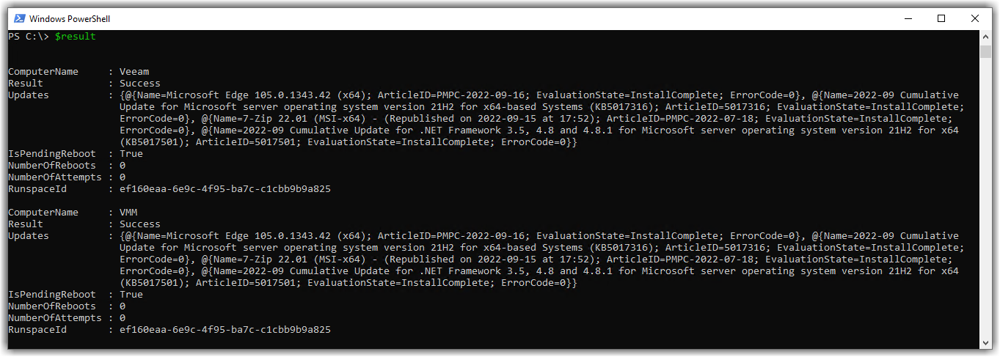

- Do you have servers in your environment that require special or manual patching?
- Do you have non-redundant application servers that must have a co-ordinated patching routine? Wish you used ConfigMgr for these but haven't figured out a way?
- Do you have spaghetti code today that attempts to orchestrate complicated patching cycles and want a cleaner solution? 

By "special patching", I mean the customer or application owners are terrified of the word "patching" and demand it be performed manually on a handful of finicky application servers out of fear of downtime. _(yeah, because hitting 'check for updates' manually reduces risk_ :unamused: _)_

This leaves you feeling frustrated in having to perform tedious manual labour. Login, point, click, sit, wait etc.. You're also annoyed the business has invested in a behemoth like ConfigMgr, and aren't using it to its full potential just for these handful of special "snowflake" servers.

This is where I tell you I wrote a PowerShell module that automates this! Which is funny because you can't automate it! You must do it manually! :laughing: but hang on let me explain..

## PSCMSnowflakePatching

[PSCMSnowflakePatching](https://github.com/codaamok/PSCMSnowflakePatching) is a PowerShell module which contains a few functions but the primary interest is in [`Invoke-CMSnowflakePatching`](https://github.com/codaamok/PSCMSnowflakePatching/blob/main/docs/Invoke-CMSoftwareUpdateInstall.md). 

In this post I want to show you why I think this function will help you patch these snowflake systems without needing to sacrifice the use of ConfigMgr. It can streamline your manual labour, or your existing automation process, or hopefully inspire you to automate a complex patching routine with it.

Using `Invoke-CMSnowflakePatching`, you can either:

- a) give it one or more hostnames via the `-ComputerName` parameter
- b) give it a ConfigMgr device collection ID via the `-CollectionId` parameter
- c) use the `-ChooseCollection` parameter and select a device collection from your environment

For each host, it will remotely start the software update installation for all updates deploy to it. By default it doesn't reboot or make any retry attempts, but there parameters for this if you need it.

- `-AllowReboot` switch will reboot the system(s) if any update returned an exit code indicating a reboot is required
- `-Retry` parameter will let you indicate the maximum number of retries you would like the function to install updates if there was a failure in the previous attempt

All hosts are processed in parallel, and you will get a live progress update from each host as it has finished patching with a break down of what updates were installed, success or failure.

If you use the either the `-ComputerName` or `-CollectionId` parameters, an output object is returned at the end with the result of patching for each host. This is great because if you want to orchestrate a complex patching routine with tools such as System Center Orchestrator or Azure Automation, you can absolutely do this with the feedback from the function.

 

In the above screenshot, you can see we're calling `Invoke-CMSnowflakePatching` and giving it a ConfigMgr device collection ID. We're capturing the output of the command by assigning it to the `$result` variable. 

It's worth calling out the times in the first two columns: the first column is the time when that line was written, and the second column is the elapsed time since the start of execution.

Beyond the first few lines revolving around startup, you can see essential information as the jobs finish patching each host. We can see the list of updates that successfully installed, and a yellow text warning indicating one of the updates put the system in a pending reboot state.

If you were running this ad-hoc and interactively, I suspect you might find this realtime information helpful. This output likely can't easily be captured by most automation tools as it's just `Write-Host`. However, this is why an output object is returned instead (see below) - this output can be captured and used however you please.



Looking at the above screenshot, this is where I believe further automation possibilities might become available for you.

The function returned a summary of the patch jobs for each host as output objects, and we captured this in the `$result` variable from the last screenshot. Here we can see valuable information that might help feed as input to other automation things.

Here is another example, if I ran the following command:

```ps
$result = Invoke-CMSnowflakePatching -ComputerName 'VEEAM' -AllowReboot -Retry 3
```

This time we're just targetting the one server, permitting the server to reboot if an update returned a hard/soft pending reboot, and allow a maximum of 3 retries if there were any installation failures.

At the end of the process, you will receive the below output object again in the `$result` variable:

```
PS C:\> $result

ComputerName    : VEEAM
Result          : Failure
Updates         : {@{Name=7-Zip 22.01 (MSI-x64); ArticleID=PMPC-2022-07-18; EvaluationState=Error;
                  ErrorCode=2147944003}, @{Name=2022-08 Security Update for Microsoft server operating system version 21H2 for x64-based Systems
                  (KB5012170); ArticleID=5012170; EvaluationState=InstallComplete; ErrorCode=0}, @{Name=2022-08 Cumulative Update for .NET Framework 3.5 and 4.8 for
                  Microsoft server operating system version 21H2 for x64 (KB5015733); ArticleID=5015733; EvaluationState=InstallComplete; ErrorCode=0},
                  @{Name=Microsoft Edge 105.0.1343.33 (x64); ArticleID=PMPC-2022-09-09; EvaluationState=InstallComplete; ErrorCode=0}}
IsPendingReboot : False
NumberOfReboots : 1
NumberOfRetries : 3
RunspaceId      : af37488e-dad9-4d56-b72a-5aa642e589e4
```

From the output above you can see the overall result from patching my Veeam server; the list of updates that were installed, whether there is a pending reboot, how many times the server was rebooted during patching, and how many times it retried.

We can see `NumberOfRetries` is 3, and that `7-Zip 22.01 (MSI-x64)` finished in a state of `Error` - it failed to install the update despite 3 attempts.

Here is the full contents of the `Updates` property of the output object in list view:

```
PS C:\> $result.Updates | fl

Name            : 7-Zip 22.01 (MSI-x64) - (Republished on 2022-09-15 at 17:52)
ArticleID       : PMPC-2022-07-18
EvaluationState : Error
ErrorCode       : 2147944003

Name            : 2022-08 Security Update for Microsoft server operating system version 21H2 for x64-based Systems (KB5012170)
ArticleID       : KB5012170
EvaluationState : InstallComplete
ErrorCode       : 0

Name            : 2022-08 Cumulative Update for .NET Framework 3.5 and 4.8 for Microsoft server operating system version 21H2 for x64 (KB5015733)
ArticleID       : KB5015733
EvaluationState : InstallComplete
ErrorCode       : 0

Name            : Microsoft Edge 105.0.1343.33 (x64)
ArticleID       : PMPC-2022-09-09
EvaluationState : InstallComplete
ErrorCode       : 0
```

With this output, you have a lot of opportunities. For example, you could feed this output to other scripts to:

- Send an email as a report with the result
- Invoke some other custom remedial actions on the server or application it hosts
- Send the data to a ticketing system using some web API, or raise an alert somewhere

Another benefit here is that you are using what you've paid for - ConfigMgr! With this approach, there will be no need to abandon usual deployment, content delivery, and reporting capabilities. The function is invoking the install of software updates on the client deployed to it from ConfigMgr.

## Interatively use PSCMSnowflakePatching with the `-ChooseCollection` Parameter

Aside from using the function like I've described above, in an automated / unattended fashion, you can still launch this from your workstation if you still wanted to monitor the progress in real-time and perform the process semi-manually.

With thie `-ChooseCollection` parameter, you'll be prompted to choose a Device Collection from ConfigMgr and the function will continue as normal - except you will not get an output object, because the information given on screen is the same.


## Why a module? Why not just a script?

This could just be my subconscious self playing games in my mind, but I feel the need to justify why this ended up being a module and not a single script file. An irrational pressure builds in my mind when I publish code online - "it must be perfect and justified!"

Jobs are used to process multiple hosts at once for patching, and I found I was re-using code to account for things like loop waiting, timeouts, and retries. You can't easily use functions defined in a script file in separate runspaces, so instead, for better management and readability, I opted for a module and for each job, I just import the module again.

## Why not use a task sequence?

I guess there could be an argument made to use a task sequence, which I wouldn't disagree with you. Whatever floats your boat. For me personally, code offers more flexibility. This is a tool to compliment your complex patching needs, if you also need the flexibility of complex patching with code and not a task sequence.

For instance, in a task sequence I don't think it's trivial to perform the same actions in a loop on a timer until it eventually succeeds. This sort of logic is littered within `Invoke-CMSnowflakePatching`, with thanks to [Cody](http://twitter.com/codymathis123) and [`New-LoopAction`](https://github.com/CodyMathis123/CM-Ramblings/blob/master/New-LoopAction.ps1) :heart:

## Why?

Andrew Porter pinged me asking if there was such script and if I would help making one. I was on paternity leave with baby brain and fancied the challenge.

Andrew found a few scripts online here and there which collectively "sort of" did what he needed:

- Method 1 – Only installs updates, doesn’t reboot or cycle through
https://timmyit.com/2016/08/01/sccm-and-powershell-force-install-of-software-updates-thats-available-on-client-through-wmi/ 
 
- Method 2 – Triggers up0dates remotely and reboots but doesn’t cycle through again or notify results
https://eskonr.com/2021/05/using-scripts-to-trigger-software-updates-remotely-from-the-sccm-console/ 
 
- Method 3 – Install updates, reboot and loops to install further updates – not completely working
https://docs.microsoft.com/en-us/answers/questions/642405/powershell-loop-install-of-available-software-upda.html 
 
- Method 4 – Installs updates on all servers in a collection, reboots and loops to install further updates
https://www.itreliable.com/wp/powershell-script-to-install-software-updates-deployed-by-sccm-and-reboot-the-computer-remotely/

Method 4 seem ideal as its code was more or less complete. I just wasn't a fan of the code while I was reading so I decided to write it again myself.

Andrew Porter recently pinged me asking if there was such script
