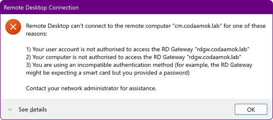
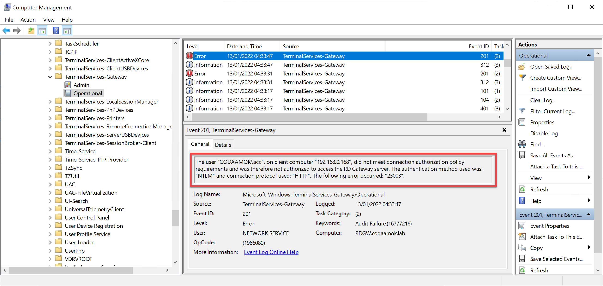
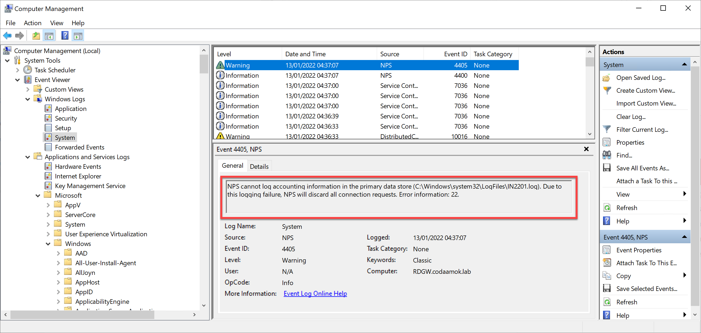
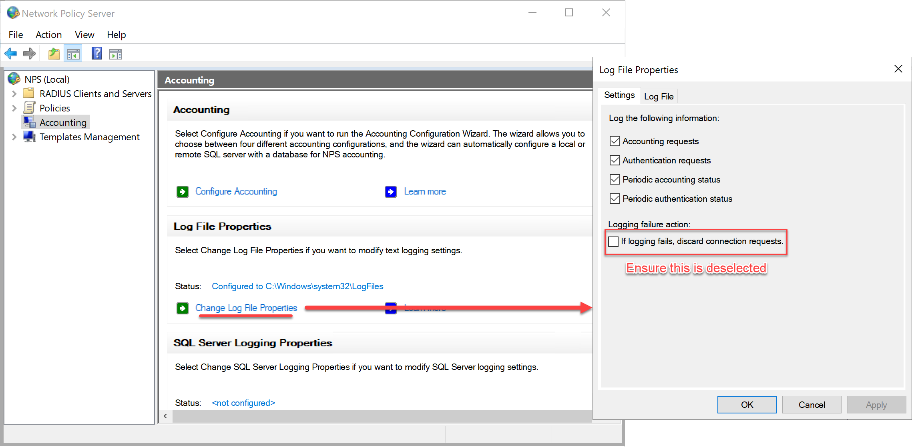

I recently set up a new lab at home and was installing Remote Desktop Gateway on Windows Server 2022. 

While setting it up, and also configuring RAS as a virtual router, I was very confused as to why I kept getting moaned at while attempting to RDP to a system using the gateway:

I was absolutely confident everything was configured correctly:

- DNS, routing, and firewall was fine
- My RAP and CAP policies in RD Gateway Manager also had the correct things set: the user account I was connected with was in the correct groups, and so were the systems I was trying to connect to.
- I had password authentication enabled, and not smartcard

I spent hours scouring "the Google" for ideas and discussions etc. All "answers" revolved around the simple misconfig of missing user/computer objects in groups of the RAP/CAP stuff.

The event viewer log for TerminalServices-Gateway was leading me up the garden path:

> The user "CODAAMOK\acc", on client computer "192.168.0.50", did not meet connection authorization policy requirements and was therefore not authorized to access the RD Gateway server. The authentication method used was: "NTLM" and connection protocol used: "HTTP". The following error occurred: "23003".

Long story short, I noticed this snippet in the System event viewer log which definitely was not useless:

> NPS cannot log accounting information in the primary data store (C:\Windows\system32\LogFiles\IN2201.log). Due to this logging failure, NPS will discard all connection requests. Error information: 22.

This little nugget left me to finding the Network Policy Server snap-in (my RD Gateway is configured to use the local NPS service, which is the default). At this point I didn't care for why it couldn't log, I just wanted to use the gateway. Under `Accounting`, select `Change Log File Properties` and you can bypass the option to abort connection if failed to log:

After making this change, I could use my new shiny RD Gateway! 

This might not be the solution for you, perhaps your issue is simply DNS/routing/firewall, or maybe you haven't correctly added your user account or server/computer you're trying to access to your RAP/CAP config. However, if you were like me, and had everything setup correctly, except this oddity, then I hope this workaround is suitable for you.
