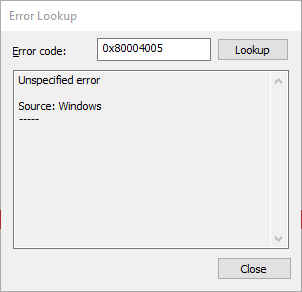

Glorious, 0x80004005.

No updates showing in Software Center? Is a client reporting in an unknown state in your reports?

Do you see this in UpdatesDeployment.log when triggering Software Update Deployment Evaluation Cycle?

```
Job error (0x80004005) received for assignment ({09985588-0eff-47e1-9f9d-3846efce8c2b}) action	
Updates will not be made available
```

Give this a whirl:

```powershell
Move-Item -Path "$env:SystemRoot\System32\GroupPolicy\Machine\Registry.pol" -Destination "$env:SystemRoot\System32\GroupPolicy\Machine\Registry.pol.old"
Invoke-GPUpdate -Force
```

Verify a new Registry.pol file is created, then trigger Software Update Deployment Evaluation Cycle and Software Updates Scan Cycle.

How did I discover? [This poor soul](http://henkhoogendoorn.blogspot.com/2015/09/software-update-error-0x80004005-on.html). Why am I sharing again? Because when you're given 0x80004005 you may feel at wit's end and struggle for direction - I'm just contributing to the Google fu pool.

