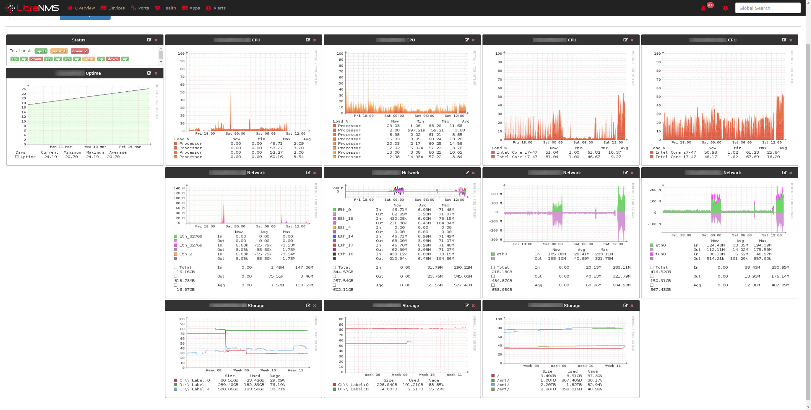

I run [LibreNMS](https://www.librenms.org/) in my homelab on a Ubuntu Server VM and it's awesome.



For a while I've been getting notifications for needing to bump from PHP 7.0 to 7.2 minimum.

I [mostly followed this post](https://ayesh.me/Ubuntu-PHP-7.2) but I'll detail a step that helped me automate installing and uninstalling all the extra modules which the last two steps seem to miss. I'll also detail a snag I hit with nginx slapping me with 500 after updating to PHP 7.2.

1. Add PPA
2. Get current packages/modules
3. Install 7.2
4. Install additional packages/modules
5. Remove old packages/modules

## Add PPA

[Yet another PPA](https://launchpad.net/~ondrej/+archive/ubuntu/php), sorry. However it does look like Ondřej Surý is a reputable Debian developer:

- [https://twitter.com/oerdnj](https://twitter.com/oerdnj)
- [https://deb.sury.org](https://deb.sury.org)
- [https://github.com/oerdnj](https://github.com/oerdnj)

```
sudo add-apt-repository ppa:ondrej/php
sudo apt update
```

\[su\_note note\_color="#FFFCCC" radius="10"\]**Important:** Make sure you read the caveats on the PPA archive webpage, you're recommended to add seperate archives depending whether you're running apache2 or nginx.\[/su\_note\]

## Get current packages/modules

This is helpful to identify what additional PHP packages you currently have installed so you can install the 7.2 equivilant too.

Worth pointing out I noticed the mcrypt package was no longer a thing in 7.2 however LibreNMS did not moan at all without it. Their [current installation docs](https://docs.librenms.org/Installation/Installation-Ubuntu-1804-Nginx/) does not install mcrypt package so that tells me it's no longer a depedency.

```
dpkg -l | grep php
```

## Install 7.2

```
apt install php7.2 php7.2-common php7.2-cli php7.2-fpm
```

## Install additional packages/modules

This bit was where I wanted to flesh it out a bit. I wanted the same modules I had for 7.0 in 7.2.

I already got the stdout stream of what's installed from `dpkg -l | grep php` and I really didn't want to re-write the results to `apt install` or any sort of copy and pasting. I wanted to make the effort to manipulate the stdout and this is what I came up with:

```
dpkg -l | grep php | cut -d' ' -f3 | grep 7.0 | sed 's/7.0/7.2/g' | awk '{print "apt install " $1 " -y"}' | xargs -0 bash -c
```

- Grab all that's installed
- Keyword search for results with "php"
- Seperate each line with a space as delimiter and grab the third field
- Search for only packages with "7.0" in string
- Substitute strings containing "7.0" with "7.2"
- For each result create a custom string that I will then execute as a command using xargs

## Remove old package/modules

More or less the same as the last. I now wanted to remove PHP 7.0.

With most things, you can achieve the same result using other methods. I made the below for no reason other than laziness. All I had to do was hit UP to get the previous command and tweak it slightly to `remove --purge` rather than `install`.

```
dpkg -l | grep php | cut -d' ' -f3 | grep 7.0 | awk '{print "apt remove --purge " $1 " -y"}' | xargs -0 bash -c
```

## The 500 snag

So after updating, rebooting and running `./daily.sh` and `./validate.php` all appeared well in the results. However the web server was failing with status code `500`. A good place to start, if I've learnt anything with ConfigMgr over the last 3 years, is always the log `/var/log/nginx/error.log`:

```
2019/03/16 13:17:16 [crit] 1103#1103: *1 connect() to unix:/var/run/php/php7.0-fpm.sock failed (2: No such file or directory) while connecting to upstream, client: 192.168.0.129, server: librenms.domain.com, request: "GET / HTTP/1.1", upstream: "fastcgi://unix:/var/run/php/php7.0-fpm.sock:", host: "192.168.0.104"
```

Looked like the web service was still trying to grab a socket file but it didn't exist. I poked around a little in `/etc/nginx` and within `/etc/nginx/conf.d/librenms.conf` sure enough there was a hardcoded reference using the offended path. I simply updated it to 7.2 instead.

```
...
 location ~ \.php {
  include fastcgi.conf;
  fastcgi_split_path_info ^(.+\.php)(/.+)$;
  fastcgi_pass unix:/var/run/php/php7.0-fpm.sock;
 }
...
```
