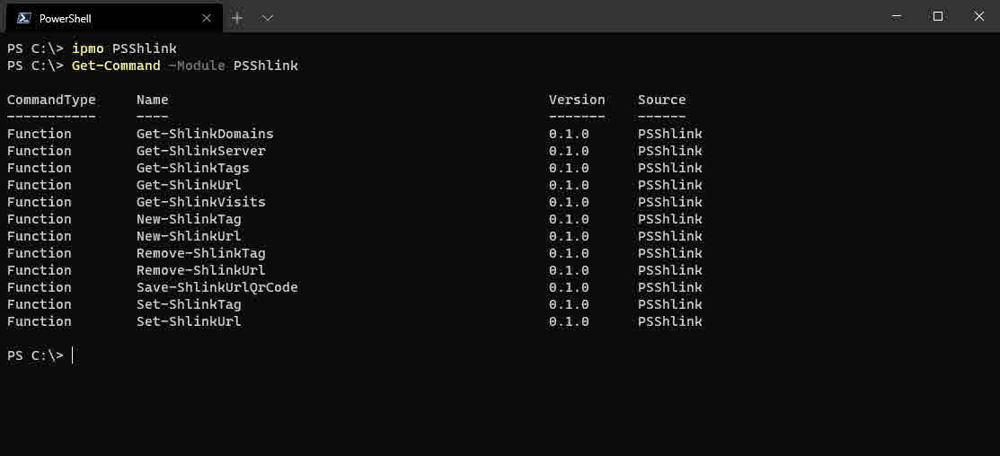

[Shlink](https://shlink.io/) is an open-source self-hosted and PHP-based URL shortener application. I wrote [PSShlink](https://github.com/codaamok/psshlink) which will help you manage all of your short codes using PowerShell!

Shlink helped me tremendously when I moved my domain and blog CMS from cookadam.co.uk to adamcook.io. Some of my posts rank modestly in search results for some keywords and I felt unhappy about letting that go. I also did not want people's bookmarks for posts using my old domain to result in an incomplete redirect to its new URL.

Google also help you secure your position in search results if you tell them your new domain. There were a couple of prerequisites to make this happen and one of them was to ensure all posts (discovered by my sitemap.xml) provided a 301 to a valid URL, usign my new domain. This is where Shlink stepped in.

Anyway, I wholeheartedly consumed Shlink which enabled me to migrate my blog to a new domain and I loved it. I moved from WordPress to using Hugo (see [Deploying Hugo Websites in Azure for Pennies or Free on GitHub Pages](https://adamcook.io/p/deploying-hugo-websites-in-azure-for-pennies-or-free-on-github-pages/)). Thankfully I didn't have too many posts to carry over. However there was enough to make me want to use a tool to convert WordPress post XML to Markdown: [lonekorean/wordpress-export-to-markdown](https://github.com/lonekorean/wordpress-export-to-markdown).

There was also enough to make my hands hurt with a lot of careful copying and pasting trying to create all the short links in Shlink for both domains `cookadam.co.uk` and `www.cookadam.co.uk`. I looked to see if there was a Shlink module in PowerShell gallery, and there wasn't. Like many other PowerShell enthusiasts, I jumped on the opportunity and wrote [PSShlink](https://github.com/codaamok/PSShlink).

## Installing PSShlink

Install the module from the PowerShell Gallery:

```powershell
Install-Module PSShlink -Scope CurrentUser
Import-Module PSShlink
```

Check out all of the available functions:

```powershell
Get-Command -Module PSShlink
```



## Authentication

Each function will have two parameters for authentication to your Shlink instance:

`-ShlinkServer`: a string value of the Shlink server address e.g. https://example.com
`-ShlinkApiKey`: a SecureString value for the Shlink server's API key

After using any function of PSShlink for the first time after importing the module - which have both parameters `-ShlinkServer` and `-ShlinkApiKey` * - it is not necessary to use the parameters again in subsequent uses for other functions of PSShlink. These values are held in memory for as long as the PowerShell session exists.

* Some functions do not require both `-ShlinkServer` and `-ShlinkApiKey`, e.g. Get`-ShlinkServer`. Therefore if the first function you use after importing PSShlink accepts only `-ShlinkServer`, you will not be asked again for this value by other functions of PSShlink. You will however be prompted for the API key. Again, subsequent uses of other functions will no longer require `-ShlinkServer` and `-ShlinkApiKey`.

If the first function you use after importing PSShlink requires `-ShlinkServer` and/or `-ShlinkApiKey` and you have not passed the parameter(s), you will be prompted for them.

## Using PSShlink

As previously mentioned, `-ShlinkApiKey` only accepts a SecureString value for simplicity we'll create a SecureString value now for our API key.

```powershell
$ApiKey = "ba6c52ed-flk5-4e84-9fc7-9c7e34825da0" | ConvertTo-SecureString -AsPlainText -Force
```

Using the newly created SecureString API key for our Shlink instance, let's query all of our short codes:

```powershell
Get-ShlinkUrl -ShlinkServer "https://myshlinkserver.com" -ShlinkApiKey $ApiKey
```

The great thing about PSShlink is that the Shlink server name and API key are held in memory for as long as the PowerShell lives. They're not accessible as variables to use outside of the ["module's scope"](https://mikefrobbins.com/2017/06/08/what-is-this-module-scope-in-powershell-that-you-speak-of/#:~:text=%E2%80%9CThe%20privacy%20of%20a%20module,do%20have%20their%20own%20scope.%E2%80%9D) though. 

This means you do not have to repeatedly supply the `-ShlinkServer` or `-ShlinkApiKey` parameters for subsequent function calls of PSShlink, so long as the first one was successful.

For example, let's save QR code images for all of our short codes:

```powershell
Get-ShlinkUrl | Save-ShlinkUrlQrCode
```

All files will be saved as png and 300x300 in size. All files by default are saved in your Downloads directory using the naming convention: `ShlinkQRCode_<shortCode>_<domain>_<size>.<format>`. e.g. `ShlinkQRCode_asFk2_example-com_300.png`. As promised, you can clearly see we did not supply the Server address or API keys and it still worked!

## Getting help

All functions come with complete comment based help, so it is possible to find examples for each function using `Get-Help`. For example, use the following to see detailed help including examples for `Save-ShlinkUrlQrCode`:

```powershell
Get-Help Save-ShlinkUrlQrCode
```

Failing that, feel free to raise an issue on the [GitHub repo](https://github.com/codaamok/PSShlink)!
